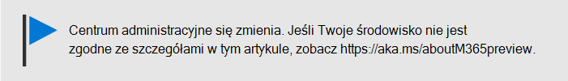
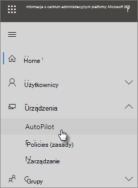

# Dodawanie urządzeń i profilu rozwiązania Autopilot przy użyciu przewodnika krok po kroku

Za pomocą rozwiązania Windows AutoPilot możesz skonfigurować nowe urządzenia z systemem **Windows** 10 dla swojej firmy, aby były gotowe do użycia, gdy podasz je pracownikom.
  
## Wymagania dotyczące urządzeń

Urządzenia muszą spełniać następujące wymagania:
  
- Windows 10 w wersji 1703 lub nowszej
    
- Nowe urządzenia, które nie były już w stanie odchyłki systemu Windows
    
## Tworzenie urządzeń i profilów za pomocą przewodnika konfiguracji

Jeśli jeszcze nie utworzono grup urządzeń ani profilów, najlepiej rozpocząć pracę, korzystając z przewodnika krok po kroku. Możesz również dodawać [urządzenia i](create-and-edit-autopilot-devices.md) [przypisywać do](create-and-edit-autopilot-profiles.md) nich profile bez korzystania z przewodnika. 
  
1. Przejdź do centrum administracyjnego w <a href="https://go.microsoft.com/fwlink/p/?linkid=837890" target="_blank">https://admin.microsoft.com</a> jęz.

2. W lewym okienku nawigacji wybierz pozycję **Devices** \> **AutoPilot (Rozwiązania przenośne).**

    
  
2. Na stronie **rozwiązania AutoPilot** kliknij lub naciśnij pozycję **Uruchom przewodnik.**
    
    
  
3. Na stronie **Przekaż plik csv z listą** urządzeń przejdź do lokalizacji, w której się przygotujemy. CSV, a następnie **otwórz przycisk** \> **Dalej.** Plik musi zawierać trzy nagłówki:
    
    - Kolumna A: Numer seryjny urządzenia
    
    - Kolumna B: Identyfikator produktu systemu Windows
    
    - Kolumna C: Skrót sprzętowy
    
    Możesz uzyskać te informacje od dostawcy sprzętu lub wygenerować plik CSV za pomocą skryptu [programu PowerShell Get-WindowsAutoPilotInfo.](https://www.powershellgallery.com/packages/Get-WindowsAutoPilotInfo) 
    
    Aby uzyskać więcej informacji, zobacz [Lista urządzeń w pliku CSV](https://docs.microsoft.com/microsoft-365/admin/misc/device-list). Możesz również pobrać przykładowy plik na stronie **Przekazywanie pliku csv z listą urządzeń**. 
    
> [!NOTE]
> W tym skrypcie jest używany program WMI do pobierania właściwości potrzebnych klientowi do zarejestrowania urządzenia w rozwiązaniach Windows Autopilot. Zwróć uwagę, że normalne jest, że wynikowy plik CSV nie zbiera wartości PKID (Windows Product ID), ponieważ nie jest to wymagane do zarejestrowania urządzenia, a wartość PKID będąca wartością NULL w wyjściowym pliku CSV jest całkowicie prawidłowa. Zostanie wypełniony tylko numer seryjny i skrót sprzętowy.
    
4. Na **stronie Przypisywanie profilu** możesz wybrać istniejący profil lub utworzyć nowy profil. Jeśli jeszcze go nie masz, zostanie wyświetlony monit o jego utworzenie. 
    
    Profil to kolekcja ustawień, które można zastosować do jednego urządzenia lub do grupy urządzeń.
    
    Funkcje domyślne są wymagane i ustawiane automatycznie. Funkcje domyślne to:
    
    - Pomiń rejestrację Cortany, usługi OneDrive i OEM.
    
    - Tworzenie środowiska logowania z marką Twojej firmy.
    
    - Połącz urządzenia z kontami usługi Azure Active Directory i automatycznie zarejestruj je, aby zarządzały usługą Microsoft 365 Business Premium.
    
    Aby uzyskać więcej informacji, zobacz Ustawienia profilu rozwiązania [AutoPilot — informacje.](autopilot-profile-settings.md) 
    
5. Pozostałe ustawienia to **Pomiń ustawienia prywatności** i **Nie zezwalaj użytkownikowi na zostanie administratorem lokalnym**. Oba są domyślnie **wyłączone**. 
    
    Wybierz przycisk **Dalej**.
    
6. **Wszystko gotowe oznacza,** że utworzony (lub wybrany) profil zostanie zastosowany do grupy urządzeń utworzonej przez Ciebie przez przekazanie listy urządzeń. Ustawienia zostaną wprowadzone po następnym zalogowaniu się użytkowników urządzenia. Wybierz pozycję **Zamknij**.
    
