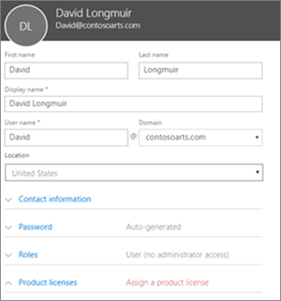
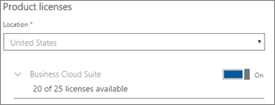

# Dodawanie większej liczby użytkowników do usługi Microsoft 365 Business

## Dodawanie nowych użytkowników.

Obejrzyj krótki film o dodawaniu użytkownika.   

> [!VIDEO https://www.microsoft.com/videoplayer/embed/RE1FOfN] 

Jeśli ten klip wideo okazał się przydatny, poznaj [kompletną serię szkoleń dla małych firm i nowych użytkowników usługi Microsoft 365](https://support.office.com/article/6ab4bbcd-79cf-4000-a0bd-d42ce4d12816).

Aby dodać użytkownika:

1. Przejdź do centrum <a href="https://go.microsoft.com/fwlink/p/?linkid=837890" target="_blank">https://admin.microsoft.com</a>administracyjnego pod adresem . 
2. W lewym okienku nawigacji wybierz pozycję **Użytkownicy** \> **aktywni użytkownicy**.
3. Na stronie **Aktywni użytkownicy** wybierz pozycję **Dodaj użytkownika**.
4. W panelu **Nowy użytkownik** wpisz wymagane informacje. 
  
    Więcej informacji można wprowadzić w obszarze **Informacje kontaktowe**, wybrać sposób ustawiania hasła w obszarze Ustawienie **Hasło** i przypisać role w obszarze **Role**.
      
    
      
    W sekcji Licencje produktów ustaw ustawienie Licencji produktu **firmy Microsoft 365 Business** na **Włączone**.
      
    
  
Aby uzyskać więcej informacji na temat dodawania użytkowników, zobacz [Dodawanie użytkowników pojedynczo lub zbiorczo](https://docs.microsoft.com/office365/admin/add-users/add-users).
  
