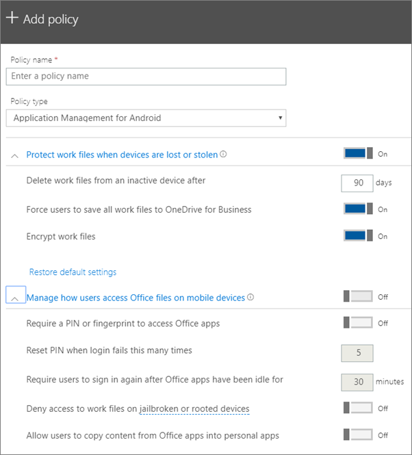

# Konfigurowanie ustawień ochrony aplikacji dla urządzeń z systemem Android lub iOS

## Tworzenie zasad zarządzania aplikacjami

1. Przejdź do centrum <a href="https://go.microsoft.com/fwlink/p/?linkid=837890" target="_blank">https://admin.microsoft.com</a>administracyjnego pod adresem . 
    
2. W lewej nav wybierz pozycję **Dodaj** **zasady** \> **urządzeń** \> .
  
3. W okienku **Dodawanie zasad** wprowadź unikatową nazwę dla zasad. 
    
4. W obszarze **Typ zasad**wybierz pozycję **Zarządzanie aplikacjami dla systemu Android** lub Zarządzanie **aplikacjami dla systemu iOS**, w zależności od zestawu zasad, które chcesz utworzyć. 
    
5. Rozwiń **Chroń pliki służbowe, gdy urządzenia zostaną utracone lub skradzione,** a **zarządzanie dostępem użytkowników do plików pakietu Office na urządzeniach przenośnych**. Skonfiguruj ustawienia, jak chcesz. **Domyślnie można zarządzać tym, jak użytkownicy uzyskują dostęp do plików pakietu Office na urządzeniach przenośnych,** **ale** zaleca się **włączenie** i zaakceptowanie wartości domyślnych. Aby uzyskać więcej informacji, zobacz [Dostępne ustawienia](#available-settings). 
    
    Aby zresetować ustawienia do wartości domyślnych, w dowolnej chwili możesz użyć linku **Resetuj ustawienia domyślne**. 
    
    
  
6. Next decide **Who will get these settings?** Jeśli nie chcesz używać domyślnej grupy zabezpieczeń **Wszyscy użytkownicy,** wybierz **pozycję Zmień** \> , wybierz grupy zabezpieczeń, które otrzymują te ustawienia **Wybierz**.
    
7. Na koniec wybierz przycisk **Gotowe**, aby zapisać zasady i zastosować je na urządzeniach. 
    
## Edytowanie zasad zarządzania aplikacjami

1. Na karcie **Zasady** wybierz pozycję **Edytowanie zasad**.
    
2. W okienku **Edytowanie zasad** wybierz zasadę, którą chcesz zmienić. 
    
3. Wybierz opcję **Edytuj** obok poszczególnych ustawień, aby zmienić wartości zasad. Po zmianie wartości jest ona automatycznie zapisywana w zasadach.
    
4. Po zakończeniu zamknij okienko **zasad Edytowanie.** 
    
## Usuwanie zasad zarządzania aplikacjami

1. Na stronie **Zasady** wybierz zasadę, a następnie **usuń**.
    
2. W okienku **zasad Usuwanie** wybierz pozycję **Potwierdź,** aby usunąć wybrane zasady lub zasady. 
    
## Dostępne ustawienia

Poniższe tabele udostępniają szczegółowe informacje o dostępnych ustawieniach w celu ochrony plików służbowych na urządzeniach oraz ustawienia, które kontrolują sposób, w jaki użytkownicy uzyskują dostęp do plików pakietu Office ze swoich urządzeń przenośnych.
  
 Aby uzyskać więcej informacji, zobacz [Jaka jest zależność między funkcjami ochrony w usłudze Microsoft 365 Business i ustawieniami usługi Intune](map-protection-features-to-intune-settings.md). 
  
### Ustawienia chroniące pliki służbowe

W przypadku zgubienia lub kradzieży urządzenia użytkownika dostępne są następujące ustawienia chroniące pliki służbowe:
  
|||
|:-----|:-----|
|Ustawienie    |Opis    |
|Usuń pliki służbowe z nieaktywnego urządzenia po określonej liczbie dni    |Jeśli urządzenie nie jest używane przez określoną tutaj liczbę dni, wszystkie pliki robocze przechowywane na urządzeniu zostaną automatycznie usunięte.    |
|Wymuszaj na użytkownikach zapisywanie wszystkich plików służbowych w usłudze OneDrive dla Firm    |Jeśli to ustawienie jest **włączone,** jedyną dostępną lokalizacją zapisu dla plików służbowych jest OneDrive dla Firm.    |
|Szyfruj pliki służbowe    |Zachowaj to ustawienie **Włączone**, aby chronić pliki służbowe przy użyciu szyfrowania. Nawet jeśli urządzenie zostanie zgubione lub skradzione, nikt nie może odczytać danych twojej firmy.    |
   
### Ustawienia, które sterują dostępem użytkowników do plików pakietu Office na urządzeniach przenośnych

Na potrzeby zarządzania dostępem użytkowników do plików służbowych w pakiecie Office dostępne są następujące ustawienia:
  
|||
|:-----|:-----|
|Ustawienie    |Opis    |
|Wymagaj numeru PIN lub odcisku palca w celu uzyskania dostępu do aplikacji pakietu Office    |Jeśli to ustawienie jest **Włączone** użytkownicy muszą podać inną formę uwierzytelniania, oprócz nazwy użytkownika i hasła, zanim będą mogli korzystać z aplikacji pakietu Office na swoich urządzeniach przenośnych.  |
|Resetuj numer PIN w przypadku wielokrotnego niepowodzenia logowania    |Aby uniemożliwić nieautoryzowanym użytkownikom odgadywanie kodu PIN, ten kod jest resetowany po określonej liczbie nieudanych prób jego podania.    |
|Wymagaj ponownego logowania użytkowników po czasie bezczynności aplikacji pakietu Office    |To ustawienie określa, jak długo użytkownik może być bezczynny, zanim zostanie poproszony o ponowne zalogowanie się.    |
|Odmów dostępu do plików służbowych na urządzeniach z usuniętymi natywnymi ograniczeniami producenta    |Sprytni użytkownicy mogą mieć urządzenie z usuniętymi natywnymi ograniczeniami producenta. Umożliwia to użytkownikowi modyfikowanie systemu operacyjnego, co może uczynić urządzenie bardziej podatnym na złośliwe oprogramowanie. Te urządzenia zostaną zablokowane, jeśli to ustawienie będzie **Włączone**.    |
|Zezwalaj użytkownikom na kopiowanie zawartości z aplikacji pakietu Office do aplikacji osobistych    |Domyślnie jest to dozwolone, ale gdy to ustawienie jest **włączone**, użytkownik może kopiować informacje z pliku służbowego do osobistego. Jeśli to ustawienie jest **wyłączone**, użytkownik nie będzie mógł kopiować informacji z konta służbowego do aplikacji osobistej ani na konto osobiste.    |
