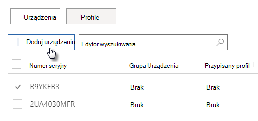

# Tworzenie i edytowanie urządzeń rozwiązania AutoPilot

## Przekazywanie listy urządzeń

Aby przekazać [urządzenia,](add-autopilot-devices-and-profile.md) możesz skorzystać z przewodnika krok po kroku, ale możesz również przekazać urządzenia na **karcie** Urządzenia. 
  
Urządzenia muszą spełniać następujące wymagania:
  
- Windows 10 w wersji 1703 lub nowszej
    
- Nowe urządzenia, które nie są już w stanie obsługi klienta systemu Windows

1. W centrum administracyjnym platformy Microsoft 365 wybierz pozycję **Devices** \> **AutoPilot (Rozwiązania rozwiązania Devices AutoPilot).**
  
2. Na stronie **AutoPilot** wybierz kartę **Urządzenia** Dodaj \> **urządzenia.**
    
    
  
3. W **panelu Dodaj urządzenia** przejdź do przygotowanego przez Ciebie pliku [CSV](../admin/misc/device-list.md) z listą urządzeń i zapisz \>  \> **zamknij.**
    
    Możesz uzyskać te informacje od producenta sprzętu lub wygenerować plik CSV za pomocą skryptu programu [PowerShell Get-WindowsAutoPilotInfo.](https://www.powershellgallery.com/packages/Get-WindowsAutoPilotInfo) 
    
## Przypisywanie profilu do urządzenia lub grupy urządzeń

1. Na stronie **Przygotowywanie systemu Windows** wybierz **kartę** Urządzenia, a następnie zaznacz pole wyboru obok jednego lub większej liczby urządzeń. 
    
2. W panelu **Urządzenie** wybierz profil z listy rozwijanej **Przypisany profil**. 
    
    Jeśli nie masz jeszcze żadnych profilów, odpowiednie instrukcje znajdziesz w temacie [Tworzenie i edytowanie profilów rozwiązania AutoPilot](create-and-edit-autopilot-profiles.md). 
