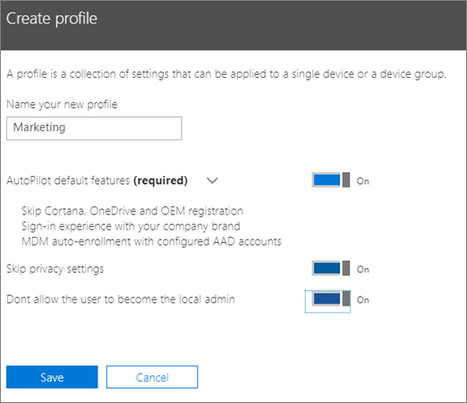
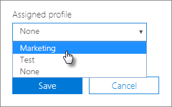

# Tworzenie i edytowanie profilów rozwiązania AutoPilotCreate and edit AutoPilot profiles

## Tworzenie profiluCreate a profile

Profil dotyczy urządzenia lub grupy urządzeń.A profile applies to a device, or a group of devices,
  
1. W centrum administracyjnym programu Microsoft 365 Business wybierz pozycję **Autopilot** **urządzeń** \> .In the Microsoft 365 Business Admin center, choose **Devices** \> **AutoPilot**.
  
2. Na stronie **Autopilot** wybierz kartę **Profile** \> **stwórz profil**.On the **AutoPilot** page, choose the **Profiles** tab \> **Create profile**.
    
3. Na stronie **Tworzenie profilu** wprowadź nazwę profilu, który pomaga go zidentyfikować, na przykład Marketing.On the **Create profile** page, enter a name for the profile that helps you identify it, for example Marketing. Włącz żądane ustawienie, a następnie wybierz pozycję **Zapisz**.Turn on the setting you want, and then choose **Save**. Aby uzyskać więcej informacji na temat ustawień profilu AutoPilot, zobacz [Ustawienia profilu AutoPilota](autopilot-profile-settings.md).For more information about AutoPilot profile settings, see [About AutoPilot Profile settings](autopilot-profile-settings.md).
    
    
  
### Stosowanie profilu do urządzeniaApply profile to a device

Po utworzeniu profilu można go zastosować do urządzenia lub grupy urządzeń.After you create a profile, you can apply it to a device or a group of devices. Możesz wybrać istniejący profil w [przewodniku krok po kroku](add-autopilot-devices-and-profile.md) i zastosować go do nowych urządzeń lub zastąpić istniejący profil dla urządzenia lub grupy urządzeń.You can pick an existing profile in the [step-by-step guide](add-autopilot-devices-and-profile.md) and apply it to new devices, or replace an existing profile for a device or group of devices. 
  
1. Na stronie **Przygotowywanie systemu Windows** wybierz kartę **Urządzenia**.On the **Prepare Windows** page, choose the **Devices** tab. 
    
2. Zaznacz pole wyboru obok nazwy urządzenia, a następnie w panelu **Urządzenie** wybierz profil \> z listy rozwijanej **Przypisany profil** **Zapisz**.Select the check box next to a device name, and in the **Device** panel, choose a profile from the **Assigned profile** drop-down list \> **Save**.
    
    
  
## Edytowanie, usuwanie lub czyszczenie profiluEdit, delete, or remove a profile

Profil przypisany do urządzenia można zaktualizować, nawet jeśli już przekazano urządzenie użytkownikowi. Gdy urządzenie łączy się z Internetem, pobiera najnowszą wersję profilu w procesie konfiguracji. Jeśli użytkownik przywróci domyślne ustawienia fabryczne na urządzeniu, ponownie pobierze ono najnowsze aktualizacje profilu.Once you've assigned a profile to a device, you can update it, even if you've already given the device to a user. When the device connects to the internet, it downloads the latest version of your profile during the setup process. If the user restores their device to its factory default settings, the device will again download the latest updates to your profile. 
  
### Edytowanie profiluEdit a profile

1. Na stronie **Przygotowywanie systemu Windows** wybierz kartę **Profile**.On the **Prepare Windows** page, choose the **Profiles** tab. 
    
2. Zaznacz pole wyboru obok nazwy urządzenia, \*\*\*\* a następnie w panelu \> Profil zaktualizuj dowolne z dostępnych ustawień **Zapisz**.Select the check box next to a device name, and in the **Profile** panel, update any of the available settings \> **Save**.
    
    Jeśli zrobisz to, zanim urządzenie użytkownika połączy się z Internetem, profil zostanie zastosowany w procesie konfiguracji.If you do this before a user connects the device to the internet, then the profile gets applied to the setup process.
    
### Usuwanie profiluDelete a profile

1. Na stronie **Przygotowywanie systemu Windows** wybierz kartę **Profile**.On the **Prepare Windows** page, choose the **Profiles** tab. 
    
2. Zaznacz pole wyboru obok nazwy urządzenia, a następnie w panelu **Profil** wybierz polecenie **Usuń zapisywanie** **profilu** \> .Select the check box next to a device name, and in the **Profile** panel, select **Delete profile** \> **Save**.
    
    Usunięty profil zostaje odłączony od urządzenia lub grupy urządzeń, do których go przypisano.When you delete a profile, it gets removed from a device or a group of devices it was assigned to.
    
### Czyszczenie profiluRemove a profile

1. Na stronie **Przygotowywanie systemu Windows** wybierz kartę **Urządzenia**.On the **Prepare Windows** page, choose the **Devices** tab. 
    
2. Zaznacz pole wyboru obok nazwy urządzenia, a następnie w panelu **Urządzenie** wybierz pozycję \> **Brak** z listy rozwijanej **Przypisany profil** **Zapisz**.Select the check box next to a device name, and in the **Device** panel, choose **None** from the **Assigned profile** drop-down list \> **Save**.
    
