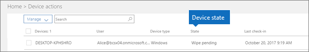

# Stany urządzeńDevice states

Urządzenia znajdujące się na liście **Akcje urządzenia** (Administrator — strona główna \> **Akcje urządzenia**) mogą mieć następujące stany.Devices in the **Device actions** list (Admin home \> **Device actions**) can have the following states.
  

  
|**Stan****Status**|**Opis****Description**|
|:-----|:-----|
|Zarządzane przez usługę IntuneManaged by Intune    |Zarządzane przez usługę Microsoft 365 Business Premium.Managed by Microsoft 365 Business Premium.    |
|Oczekiwanie na wycofanieRetire pending    |Usługa Microsoft 365 Business Premium przygotowuje się do usunięcia danych firmowych z urządzenia.Microsoft 365 Business Premium is getting ready to remove company data from the device.    |
|Wycofywanie w tokuRetire in progress    |Usługa Microsoft 365 Business Premium obecnie usuwa dane firmowe z urządzenia.Microsoft 365 Business Premium is currently removing company data from the device.    |
|Wycofywanie nie powiodło sięRetire failed    | Akcja usuwania danych firmy nie powiodła się.Remove company data action failed.    |
|Wycofaj anulowanoRetire canceled    |Działanie na emeryturę zostało anulowane.Retire action was canceled.    |
|Oczekiwanie na wyczyszczenieWipe pending    |Trwa oczekiwanie na rozpoczęcie przywracania ustawień fabrycznych.Waiting for factory reset to start.    |
|Czyszczenie w tokuWipe in progress    |Wywołano polecenie przywracania ustawień fabrycznych.Factory reset has been issued.    |
|Czyszczenie nie powiodło sięWipe failed    |Nie można przywrócić ustawień fabrycznych.Couldn't do factory reset.    |
|Wyczyść anulowaneWipe canceled    |Czyszczenie fabryczne zostało anulowane.Factory wipe was canceled.    |
|Zła kondycjaUnhealthy    |Akcja jest w toku (lub w toku), ale urządzenie nie zostało zaewidencjonowane przez ponad 30 dni.An action is pending (or in progress), but the device hasn't checked in for 30+ days.    |
|Oczekiwanie na usunięcieDelete pending    |Trwa oczekiwanie na akcję usuwania.Delete action is pending.    |
|OdnalezionoDiscovered    |Usługa Microsoft 365 Business Premium wykryła urządzenie.Microsoft 365 Business Premium has detected the device.    |
   
