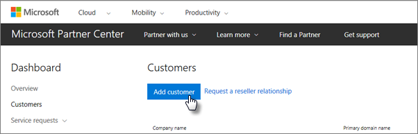
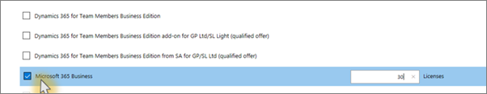

# Uzyskiwanie usługi Microsoft 365 Business Premium

## Uzyskaj microsoft 365 Business Premium od firmy Microsoft

Jeśli nie masz partnera i chcesz uzyskać Microsoft 365 Business Premium, możesz [go kupić tutaj.](https://www.microsoft.com/en-US/microsoft-365/business)

Szczegółowe instrukcje [można znaleźć w usłudze Microsoft 365 Business Premium.](sign-up.md)

Możesz również udać się do [sklepu Microsoft Store,](https://www.microsoft.com/en-us/store/locations/find-a-store?icid=en_US_Store_UH_FAS) aby kupić usługę Microsoft 365 Business Premium i uzyskać pomoc dotyczącą konfiguracji.
  
## Pobierz usługę Microsoft 365 Business Premium z Centrum partnerów firmy Microsoft

1. Zaloguj się do [Centrum partnerskiego firmy Microsoft](https://go.microsoft.com/fwlink/p/?linkid=849910), korzystając z poświadczeń utworzonych podczas rejestracji w programie Cloud Service Provider (CSP). 
    
2. Na pulpicie nawigacyjnym partnerów wybierz pozycję **Klienci**, a następnie wybierz klienta lub dodaj nowego klienta przed uzyskaniem usługi Microsoft 365 Business Premium.
    
    
  
3. Na stronie **Subskrypcja** klienta wybierz pozycję **Dodaj subskrypcję**, wybierz opcję Mała firma w obszarze Katalog, a następnie wybierz pozycję **Microsoft 365 Business Premium**.
    
    Wybierz liczbę potrzebnych licencji (maksymalnie 300). Jeśli masz ponad 300 użytkowników, przejdź do usługi [Microsoft 365 Enterprise](https://go.microsoft.com/fwlink/p/?linkid=862316). 
    
    
  
    Wykonaj pozostałe kroki dotyczące dodawania nowego klienta, w tym nazwę firmy.
    

