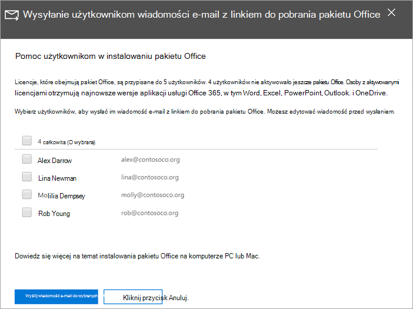

# Pomaganie użytkownikom w instalacji pakietu Office na urządzeniach z systemem Windows 10

Za pomocą centrum administracyjnego platformy Microsoft 365 możesz szybko i łatwo zainstalować pakiet Office na komputerach z systemem Windows 10.
  
Aby dowiedzieć się, jak to działa w przypadku wcześniej zainstalowanych aplikacji pakietu Office, przed rozpoczęciem przeczytaj artykuł na temat [przygotowywania się do instalacji aplikacji klienckich pakietu Office](prepare-for-office-client-deployment.md).

Obejrzyj krótki klip wideo na temat instalowania aplikacji pakietu Office.  

> [!VIDEO https://www.microsoft.com/videoplayer/embed/acce002c-0756-4b64-ac5d-2198ee96a9b1] 

Jeśli ten klip wideo okazał się przydatny, poznaj [kompletną serię szkoleń dla małych firm i nowych użytkowników usługi Microsoft 365](https://support.microsoft.com/office/6ab4bbcd-79cf-4000-a0bd-d42ce4d12816).

## Zarządzanie wdrożeniami pakietu Office

1. Przejdź do centrum administracyjnego w <a href="https://go.microsoft.com/fwlink/p/?linkid=2024339" target="_blank">https://admin.microsoft.com</a> znakiem , a następnie zaloguj się przy użyciu poświadczeń administratora globalnego. 

2. W lewym **okienku** nawigacji przejdź do okna Konfiguracja i na stronie **Konfiguracja** przewiń do **strony Aplikacje i aktualizacje.**
    > [!NOTE]
    > Ta karta może nie być widzisz, jeśli wszyscy użytkownicy mają zainstalowane aplikacje pakietu Office.
  
3. Na karcie **Pomaganie użytkownikom w instalowaniu aplikacji pakietu Office** wybierz **pozycję Wyświetl**, a następnie **pozycję Wprowadzenie.**
    
4. W **panelu Wyślij użytkownikom wiadomość e-mail** z linkiem do pobrania pakietu Office wybierz użytkowników, których chcesz wysłać wiadomość e-mail, a następnie wybierz **pozycję Wyślij wybranym użytkownikom pocztą e-mail.**

   

## Aby uzyskać więcej informacji na temat konfigurowania i używania usługi Microsoft 365 Business Premium

[Szkoleniowe klipy wideo dotyczące platformy Microsoft 365 dla firm](https://support.microsoft.com/office/6ab4bbcd-79cf-4000-a0bd-d42ce4d12816)