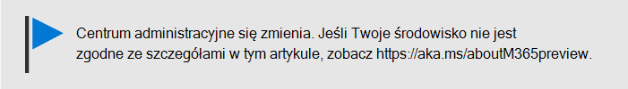

# Pomaganie użytkownikom w Office na Windows 10 urządzeniachHelp your users install Office on Windows 10 devices

Możesz szybko i łatwo zainstalować Office na Windows 10 PC z Microsoft 365 administracyjnego.You can quickly and easily install Office on Windows 10 PCs from the Microsoft 365 admin center.
  
Aby dowiedzieć się, jak to działa w przypadku wcześniej zainstalowanych aplikacji pakietu Office, przed rozpoczęciem przeczytaj artykuł na temat [przygotowywania się do instalacji aplikacji klienckich pakietu Office](prepare-for-office-client-deployment.md).To understand how this works with previously installed Office apps, read [Prepare for Office client installation](prepare-for-office-client-deployment.md) before you get started.

Obejrzyj krótki klip wideo na temat instalowania Office aplikacji.Watch a short video about installing Office apps.  

> [!VIDEO https://www.microsoft.com/videoplayer/embed/acce002c-0756-4b64-ac5d-2198ee96a9b1] 

Jeśli ten klip wideo okazał się przydatny, poznaj [kompletną serię szkoleń dla małych firm i nowych użytkowników usługi Microsoft 365](../business-video/index.yml).If you found this video helpful, check out the [complete training series for small businesses and those new to Microsoft 365](../business-video/index.yml).

## Zarządzanie wdrożeniami pakietu OfficeManage Office deployments

1. Przejdź do centrum administracyjnego w <a href="https://go.microsoft.com/fwlink/p/?linkid=2024339" target="_blank">https://admin.microsoft.com</a> znakiem , a następnie zaloguj się przy użyciu poświadczeń administratora globalnego.Go to the admin center at <a href="https://go.microsoft.com/fwlink/p/?linkid=2024339" target="_blank">https://admin.microsoft.com</a>, and sign in with global admin credentials. 

2. W lewym **okienku** nawigacji przejdź do okna Konfiguracja i na stronie **Konfiguracja** przewiń do **strony Aplikacje i aktualizacje.**Go to **Setup** in the left navigation pane, and on the **Setup** page, scroll to **Apps and updates**.
    > [!NOTE]
    > Ta karta może nie być widzisz, jeśli wszyscy użytkownicy mają zainstalowane Office aplikacje.You might not see this card if all of your  users have installed Office apps.
  
3. Na karcie **Pomóż użytkownikom instalować aplikacje Office wybierz** pozycję **Wyświetl**, a następnie **Wprowadzenie.**On the **Help users install their Office apps** card, choose **View**, and then **Get started**.
    
4. W **panelu Wyślij użytkownikom wiadomość e-mail z łączem do** pobrania Office wybierz użytkowników, których chcesz wysłać wiadomość e-mail, a następnie wybierz pozycję Wyślij **do wybranych użytkowników pocztą e-mail.**On the **Email users a link to download Office** panel, select the users you want to email, and then **Email selected users**.

   

## Aby uzyskać więcej informacji na temat konfigurowania i używania programu Microsoft 365 Business PremiumFor more on setting up and using Microsoft 365 Business Premium

[Microsoft 365 szkoleniowe klipy wideo dla firmMicrosoft 365 for business training videos](../business-video/index.yml)