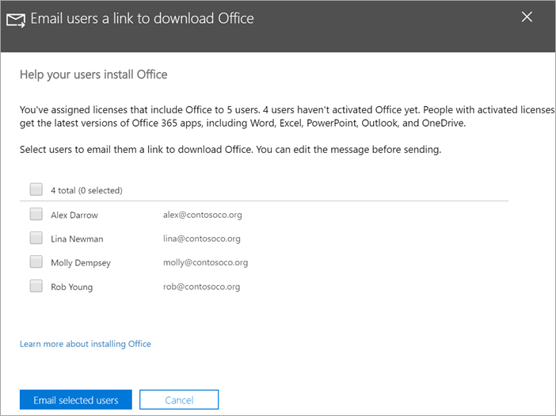

# Pomóż użytkownikom instalować pakiet Office na urządzeniach z systemem Windows 10

Możesz szybko i łatwo zainstalować pakiet Office na komputerach z systemem Windows 10, korzystając z centrum administracyjnego Microsoft 365.
  
Aby dowiedzieć się, jak to działa w przypadku wcześniej zainstalowanych aplikacji pakietu Office, przed rozpoczęciem przeczytaj artykuł na temat [przygotowywania się do instalacji aplikacji klienckich pakietu Office](prepare-for-office-client-deployment.md).

Obejrzyj krótki klip wideo o instalowaniu aplikacji pakietu Office.  

> [!VIDEO https://www.microsoft.com/videoplayer/embed/acce002c-0756-4b64-ac5d-2198ee96a9b1] 

Jeśli ten klip wideo okazał się przydatny, poznaj [kompletną serię szkoleń dla małych firm i nowych użytkowników usługi Microsoft 365](https://support.microsoft.com/office/6ab4bbcd-79cf-4000-a0bd-d42ce4d12816).

## Zarządzanie wdrożeniami pakietu Office

1. Przejdź do centrum administracyjnego o godzinie <a href="https://go.microsoft.com/fwlink/p/?linkid=2024339" target="_blank">https://admin.microsoft.com</a> i zaloguj się przy użyciu poświadczeń administratora globalnego. 

2. Przejdź do **ustawień** w lewym okienku nawigacji, a następnie na stronie **konfiguracji** przewiń do obszaru **aplikacje i aktualizacje**.
    > [!NOTE]
    > Ta karta może być niewidoczna, jeśli wszyscy użytkownicy zainstalowali aplikacje pakietu Office.
  
3. Na karcie **Pomóż użytkownikom instalować swoją kartę aplikacje pakietu Office** wybierz pozycję **Widok**, a następnie **Zacznij**.
    
4. W oknie **Użytkownicy poczty e-mail łącze umożliwiające pobranie panelu Office** wybierz użytkowników, których chcesz wysłać pocztą e-mail, a następnie **Wyślij wybranych użytkowników pocztą e-mail**.

   

## Aby uzyskać więcej informacji na temat konfigurowania i korzystania z aplikacji Microsoft 365 Business Premium

[Szkolenia wideo dotyczące programu Microsoft 365 dla firm](https://support.microsoft.com/office/6ab4bbcd-79cf-4000-a0bd-d42ce4d12816)
