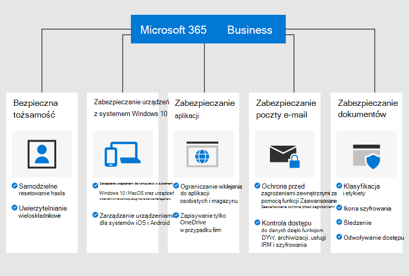

# Omówienie usługi Microsoft 365 Business Premium

## Co to jest usługa Microsoft 365 Business Premium

Microsoft 365 Business Premium (dawniej Microsoft 365 Business) to kompleksowa usługa subskrypcyjna dla firm zatrudniających mniej niż 300 pracowników. Łączy ona Twoje ulubione aplikacje i usługi zwiększające produktywność będące częścią pakietu Office oraz narzędzia do współpracy, takie jak Microsoft Teams, z zaawansowanymi funkcjami zabezpieczeń oraz możliwościami zarządzania urządzeniami.

Obejrzyj ten krótki klip wideo, aby poznać usługę Microsoft 365 Business Premium.  

> [!VIDEO https://www.microsoft.com/videoplayer/embed/RE2mhaA] 
  
Jeśli ten klip wideo okazał się przydatny, poznaj [kompletną serię szkoleń dla małych firm i nowych użytkowników usługi Microsoft 365](https://support.microsoft.com/office/6ab4bbcd-79cf-4000-a0bd-d42ce4d12816). 

Usługa Microsoft 365 Business Premium jest przeznaczona dla maksymalnie 300 licencji. Jeśli potrzebujesz większej liczby licencji, zapoznaj się z dokumentacją usługi [Microsoft 365 Enterprise](https://go.microsoft.com/fwlink/p/?linkid=860986), aby uzyskać więcej informacji.

Aby zapoznać się z pełną listą funkcji, zobacz [Opis subskrypcji Microsoft 365 Business Premium](https://docs.microsoft.com/office365/servicedescriptions/microsoft-365-service-descriptions/microsoft-365-business-service-description).
  
## Potrzeby małych firm z zakresu bezpieczeństwa

Dane biznesowe mogą trafić w niepowołane ręce na wiele sposobów. Wraz z Twoimi użytkownikami możecie narażać firmę na niebezpieczeństwo, logując się za pomocą danych logowania, które zostały naruszone, lub przeglądając dane firmowe na różnych urządzeniach i w różnych aplikacjach. Następujące naruszenia narażają Twoją organizację na ryzyko:

- Naruszone lub słabe poświadczenia logowania.
- Naruszone urządzenia ze słabymi kodami PIN lub urządzenia prywatne.
- Użytkownicy z uprawnieniami do kopiowania i wklejania danych organizacji lub zapisywania ich w aplikacjach osobistych.
- Użytkownicy, którzy używają aplikacji innych firm ze słabymi zabezpieczeniami.
- Luki w zabezpieczeniach poczty e-mail, np. udostępnianie poufnych danych, próby wyłudzeń, złośliwe oprogramowanie itd.
- Osoby niepowołane mające dostęp do dokumentów z informacjami poufnymi.

Usługa Microsoft 365 Business Premium chroni Twoje dane przed każdym z powyższych zagrożeń. Poniższa ilustracja szczegółowo przedstawia funkcje zabezpieczeń, które chronią dane Twojej firmy.

## Jak chronimy Twoje dane i urządzenia

Usługa Microsoft 365 Business Premium **chroni przed zagrożeniami** dzięki następującym rozwiązaniom:

- Skanowanie linków w wiadomościach e-mail i dokumentach w czasie rzeczywistym, które blokuje niebezpiecznych witryny (bezpieczne linki zaawansowanej ochrony przed zagrożeniami).

- Zaawansowana analiza załączników w wiadomościach e-mail w środowisku piaskownicy w celu wykrywania nowego złośliwego oprogramowania (bezpieczne załączniki zaawansowanej ochrony przed zagrożeniami). 

- Zasady ochrony przed wyłudzaniem informacji, które korzystają z uczenia maszynowego i wykrywania podszywania się, zapewniając ochronę przed zaawansowanymi atakami (mechanizmy ochrony przed wyłudzaniem informacji zaawansowanej ochrony przed zagrożeniami). 

- Zaawansowane zasady uniemożliwiające dostęp z niezaufanych lokalizacji i pomijanie uwierzytelniania wieloskładnikowego w przypadku lokalizacji zaufanych, takich jak sieć biurowa (uwierzytelnianie wieloskładnikowe Azure, w tym zaufane adresy IP i dostęp warunkowy). 

- Ochrona przed złośliwym oprogramowaniem na wszystkich urządzeniach z systemem Windows 10 w organizacji oraz ochrona plików w kluczowych folderach systemowych przed zmianami wprowadzanymi przez oprogramowanie wymuszające okup (Windows Defender)

Twoje **dane biznesowe** chronią następujące zabezpieczenia:

- Automatyczne wykrywanie zapobiegające wyciekowi wrażliwych informacji poza firmę, takich jak numery ubezpieczeń społecznych lub dane kart kredytowych (zapobieganie utracie danych). 

- Szyfrowanie wiadomości e-mail zawierających poufne informacje, dzięki któremu możesz bezpiecznie komunikować się z klientami i innymi osobami spoza Twojej organizacji. Dzięki temu tylko właściwy adresat będzie mógł odczytać wysłaną wiadomość (szyfrowanie wiadomości usługi Office 365).

- Kontrolowanie tego, którzy użytkownicy mają dostęp do informacji firmowych, przy użyciu ograniczeń wiadomości e-mail i dokumentów, takich jak **Nie kopiować** i **Nie przesyłać dalej** (Azure Information Protection, plan 1).

- Włączenie nieograniczonej archiwizacji w chmurze, aby można było zapisać całą komunikację e-mail w organizacji, w tym zawartość skrzynek pocztowych byłych pracowników (Exchange Online — archiwum).

Twoje **urządzenia są zabezpieczone** dzięki następującym rozwiązaniom:

- Kontrolowanie tego, które urządzenia i którzy użytkownicy mogą uzyskiwać dostęp do Twoich danych konta Microsoft, oraz użycie opcji umożliwiających blokowanie logowania użytkowników na komputerach domowych, w niezatwierdzonych aplikacjach lub poza godzinami pracy (dostęp warunkowy).

- Stosowanie zasad zabezpieczeń w celu ochrony danych biznesowych na urządzeniach z systemami iOS i Android. Na przykład możesz wymagać od użytkowników podawania kodu PIN lub skanowania odcisku palca w celu uzyskania dostępu do danych biznesowych, a także szyfrować dane na urządzeniach przenośnych (ochrona aplikacji mobilnych pakietu Office).

- Przechowywanie dokumentów biznesowych, wiadomości e-mail i innych danych w zatwierdzonych aplikacjach mobilnych pakietu Office oraz uniemożliwianie pracownikom zapisywania tych elementów w nieautoryzowanych aplikacjach i lokalizacjach (ochrona aplikacji mobilnych pakietu Office).

- Zdalne czyszczenie danych biznesowych ze zgubionych i skradzionych urządzeń bez wpływu na dane osobowe (Intune — selektywne czyszczenie).

- Zarządzanie zasadami dla wszystkich komputerów z systemem Windows 10 w firmie przy użyciu uproszczonych kontrolek, wymuszanie szyfrowania funkcji BitLocker i automatyczne instalowanie krytycznych aktualizacji systemu Windows (wymuszanie zasad aktualizacji systemu Windows).

Aby sprawdzić listę wszystkich funkcji zabezpieczeń, zobacz [Funkcje zabezpieczeń usługi Microsoft 365 Business Premium](security-features.md). Po [skonfigurowaniu usługi Microsoft 365 Business Premium](set-up.md) dowiedz się, jak [zwiększyć ochronę przed zagrożeniami](increase-threat-protection.md), i [skonfiguruj funkcje zgodności](set-up-compliance.md), aby zacząć korzystać z zabezpieczeń, które nie są uwzględnione w przewodniku instalacji. Przeczytaj też [10 najlepszych sposobów zabezpieczania planów usługi Office 365 i Microsoft 365 Business Premium](https://docs.microsoft.com/office365/admin/security-and-compliance/secure-your-business-data), gdzie znajdziesz dokładne omówienie konfiguracji zabezpieczeń przed cyberprzestępcami i hakerami.

## Uzyskiwanie usługi Microsoft 365 Business Premium

- Partnerzy otrzymają usługę Microsoft 365 Business Premium: [Uzyskiwanie usługi Microsoft 365 Business Premium w Centrum partnerskim firmy Microsoft](get-microsoft-365-business.md).

- Jeśli nie masz partnera i chcesz zacząć korzystać z usługi Microsoft 365 Business Premium, możesz [kupić ją tutaj](https://www.microsoft.com/microsoft-365/business). Postępuj zgodnie z instrukcjami [tworzenia konta](sign-up.md).

## Zobacz też

[Szkoleniowe klipy wideo dotyczące usługi Microsoft 365 Business Premium](https://support.microsoft.com/office/6ab4bbcd-79cf-4000-a0bd-d42ce4d12816)
