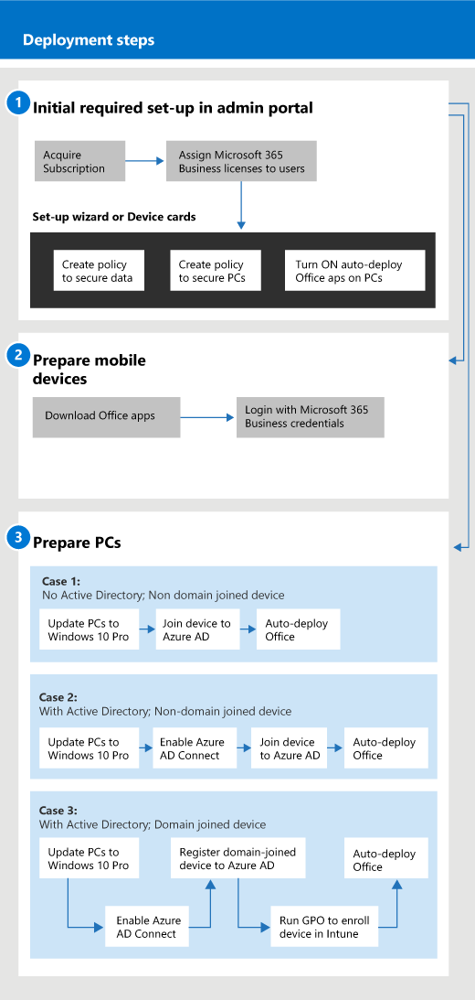

# Wprowadzenie do usługi Microsoft 365 dla firmGet started with Microsoft 365 for business

## Co to jest Microsoft 365 dla firmWhat is Microsoft 365 for business

Microsoft 365 dla firm to kompleksowy zestaw narzędzi do produktywności i współpracy biznesowej, takich jak Outlook, Word, Excel i inne produkty pakietu Office, które są zawsze aktualne.Microsoft 365 for business is a comprehensive set of business productivity and collaboration tools, such as Outlook, Word, Excel, and other Office products, that are always up to date. Pliki robocze można chronić na wszystkich urządzeniach z systemami iOS, Android i Windows 10 za pomocą prostych w zarządzaniu zabezpieczeń klasy korporacyjnej.You can protect your work files on all your iOS, Android, and Windows 10 devices with enterprise-grade security that is simple to manage.

Obejrzyj ten klip wideo, aby uzyskać krótki przegląd usługi Microsoft 365 dla firm.Watch this video for a quick overview of Microsoft 365 for business.  

> [!VIDEO https://www.microsoft.com/videoplayer/embed/RE2mhaA] 
  
Usługa Microsoft 365 dla firm jest przeznaczona dla maksymalnie 300 licencji.Microsoft 365 for business is meant for up to 300 licenses. Jeśli potrzebujesz większej liczby licencji, zapoznaj się z dokumentacją usługi [Microsoft 365 Enterprise](https://go.microsoft.com/fwlink/p/?linkid=860986), aby uzyskać więcej informacji.If you need more licenses, see [Microsoft 365 Enterprise](https://go.microsoft.com/fwlink/p/?linkid=860986) documentation for more information. 
  
## Uzyskaj usługę Microsoft 365 dla firmGet Microsoft 365 for business

- Jeśli masz partnera, otrzymają microsoft 365 dla firm: [Pobierz microsoft 365 dla firm z Microsoft Partner Center](get-microsoft-365-business.md).If you have a partner, they'll get Microsoft 365 for business: [Get Microsoft 365 for business from Microsoft Partner Center](get-microsoft-365-business.md).
    
- Jeśli nie masz partnera i chcesz uzyskać Microsoft 365 dla biznesu, możesz [go kupić tutaj](https://www.microsoft.com/microsoft-365/business).If you don't have a partner and want to get Microsoft 365 for business, you can [buy it here](https://www.microsoft.com/microsoft-365/business).
    
## Konfigurowanie usługi Microsoft 365 dla firmSet up Microsoft 365 for business

 **Omówienie konfiguracji pakietu Microsoft 365 dla firm****Overview of Microsoft 365 for business Suite set up**
  
Na poniższym diagramie opisano, jak administratorzy skonfigurować usługę Microsoft 365 dla firm.The following diagram describes how admins set up Microsoft 365 for business. Opisano w nim również kroki przygotowania komputerów z systemem Windows dla usługi Microsoft 365 dla firm.It also describes the steps to prepare Windows PCs for Microsoft 365 for business. Za pomocą [programu Windows AutoPilot](add-autopilot-devices-and-profile.md)można również dodawać nowe urządzenia w centrum administracyjnym usługi Microsoft 365.You can also add new devices in the Microsoft 365 admin center with [Windows AutoPilot](add-autopilot-devices-and-profile.md). Za pomocą programu AutoPilot można skonfigurować i wstępnie skonfigurować nowe urządzenia, tak aby były one gotowe do wydajnego użytku, gdy tylko użytkownik zaloguje się przy użyciu swoich poświadczeń usługi Microsoft 365 dla firm.You can use AutoPilot to set up and pre-configure new devices so that they're ready for productive use as soon as a user signs in with their Microsoft 365 for business credentials.
  

Obejrzyj ten klip wideo, aby zapoznać się z omówieniem konfiguracji usługi Microsoft 365 dla firm.Watch this video for an overview of Microsoft 365 for business setup.  

> [!VIDEO https://www.microsoft.com/videoplayer/embed/RE1FYSM] 

Jeśli ten klip wideo okazał się przydatny, poznaj [kompletną serię szkoleń dla małych firm i nowych użytkowników usługi Microsoft 365](https://support.microsoft.com/office/6ab4bbcd-79cf-4000-a0bd-d42ce4d12816).If you found this video helpful, check out the [complete training series for small businesses and those new to Microsoft 365](https://support.microsoft.com/office/6ab4bbcd-79cf-4000-a0bd-d42ce4d12816).

  
### 1: Konfigurowanie usługi Microsoft 365 dla firm (administrator)1: Set up Microsoft 365 for business (Admin)

Zaloguj się do [centrum administracyjnego usługi Microsoft 365](https://portal.office.com/adminportal/home) przy użyciu poświadczeń administratora globalnego i wykonaj następujące czynności, aby skonfigurować usługę Microsoft 365 dla firm.Sign in to [Microsoft 365 admin center](https://portal.office.com/adminportal/home) with your global admin credentials, and complete the following steps to set up Microsoft 365 for business. 
  
1. [Wymagania wstępne dotyczące ochrony danych na urządzeniach za pomocą usługi Microsoft 365 dla firmPrerequisites for protecting data on devices with Microsoft 365 for business](pre-requisites-for-data-protection.md)
    
    Najpierw przeczytaj wymagania wstępne, aby upewnić się, że urządzenia są gotowe do pracy w usłudze Microsoft 365 dla firm.Read the prerequisites first to make sure that your devices are ready for Microsoft 365 for business.
    
2. [Konfigurowanie usługi Microsoft 365 dla firm za pomocą kreatora instalacjiUse the setup wizard to set up Microsoft 365 for business](set-up.md)
    
    Jeśli **trwale przenosisz się z lokalnej usługi Active Directory do chmury,** możesz przejść do centrum administracyjnego usługi Microsoft 365 i użyć kreatora konfiguracji, aby ręcznie dodać użytkowników lub przeprowadzić jednorazową synchronizację z usługą Azure AD Connect.If you're **permanently moving from a local Active Directory to the cloud**, you can go to the Microsoft 365 admin center and use the setup wizard to add your users manually, or you can do a one-time sync with Azure AD Connect. Istnieją dwa sposoby wykonywania tej czynności:There are two ways to do this: 
    
    - Jeśli masz również serwer Exchange 2010, Exchange 2013 lub Exchange 2016, możesz [użyć minimalnej hybrydy, aby szybko przeprowadzić migrację skrzynek pocztowych programu Exchange do usługi Microsoft 365](https://docs.microsoft.com/Exchange/mailbox-migration/use-minimal-hybrid-to-quickly-migrate).If you also have an Exchange 2010, Exchange 2013, or Exchange 2016 server, you can [Use Minimal Hybrid to quickly migrate Exchange mailboxes to Microsoft 365](https://docs.microsoft.com/Exchange/mailbox-migration/use-minimal-hybrid-to-quickly-migrate). Minimalne kroki hybrydowe obejmują jednorazową synchronizację użytkowników z usługą Azure AD i migrację poczty e-mail z lokalnego do chmury.The minimal hybrid steps include a one-time sync of users to Azure AD, and email migration from on-premises to the cloud. Po zakończeniu migracji wiadomości e-mail synchronizacja katalogów jest automatycznie wyłączana podczas korzystania z tej metody.After the email migration is complete, the directory synchronization is automatically turned off when you use this method.
    
    - Użyj kreatora synchronizacji katalogów, aby zsynchronizować użytkowników z chmurą.Use the directory sync wizard to synchronize your users to the cloud. Wykonaj kroki opisane w [obszarze Konfigurowanie synchronizacji katalogów dla usługi Microsoft 365,](https://docs.microsoft.com/office365/enterprise/set-up-directory-synchronization) aby ukończyć ten proces.Follow the steps in [Set up directory synchronization for Microsoft 365](https://docs.microsoft.com/office365/enterprise/set-up-directory-synchronization) to complete this process. Po zsynchronizowaniu użytkowników z chmurą należy [wyłączyć synchronizację katalogów dla usługi Microsoft 365](https://docs.microsoft.com/office365/enterprise/turn-off-directory-synchronization).After you synchronize your users to the cloud, you'll have to [Turn off directory synchronization for Microsoft 365](https://docs.microsoft.com/office365/enterprise/turn-off-directory-synchronization).
    
    Musisz również dać każdemu użytkownikowi, który został dodany w ten sposób licencję do usługi Microsoft 365 dla firm.You'll also have to give each user that was added this way a license to Microsoft 365 for business. Można to zrobić w [kreatorze instalacji](set-up.md) lub można [przypisać licencje do użytkowników](../admin/manage/assign-licenses-to-users.md).You can do this in the [setup wizard](set-up.md) or you can [Assign licenses to users](../admin/manage/assign-licenses-to-users.md).
    
### 2: Przygotowanie urządzeń mobilnych2: Prepare mobile devices

Wykonaj czynności opisane w obszarze [Konfigurowanie urządzeń przenośnych dla usługi Microsoft 365 dla użytkowników biznesowych](set-up-mobile-devices.md) w celu instalowania aplikacji pakietu Office na urządzeniach i upewnienia się, że są one chronione przez usługę Microsoft 365 dla firm.Follow the steps in [Set up mobile devices for Microsoft 365 for business users](set-up-mobile-devices.md) to install Office apps on devices and make sure they're protected by Microsoft 365 for business. 
  
### 3: Przygotowanie komputerów3: Prepare PCs

Administratorzy mogą wstępnie wybrać ustawienia dla nowych komputerów z systemem Windows 10 za pomocą [programu Windows AutoPilot](add-autopilot-devices-and-profile.md).Admins can pre-select settings for new Windows 10 PCs by using [Windows AutoPilot](add-autopilot-devices-and-profile.md). Użytkownicy mogą skonfigurować istniejące lub nowe urządzenia z systemem Windows 10, wykonując kroki opisane w tym temacie: [Konfigurowanie komputerów z systemem Windows dla usługi Microsoft 365 dla użytkowników biznesowych.](set-up-windows-devices.md)Users can set up their existing or new Windows 10 devices by following the steps in this topic: [Set up Windows PCs for Microsoft 365 for business users](set-up-windows-devices.md). W przypadku istniejących urządzeń użytkownicy mogą **opcjonalnie** [przenosić pliki do usługi OneDrive dla Firm](move-files-to-onedrive.md).For existing devices, users can **optionally** [move files to OneDrive for Business](move-files-to-onedrive.md). Mogą również używać narzędzi innych firm do przenoszenia plików skojarzonych z profilem systemu Windows do usługi OneDrive.They can also use third-party tools to move files associated with Windows profile to OneDrive.
  
Jeśli twoja organizacja korzysta z usługi Windows Server Active Directory lokalnie, można skonfigurować usługę Microsoft 365 dla firm w celu ochrony urządzeń z systemem Windows 10, zachowując jednocześnie dostęp do zasobów lokalnych wymagających uwierzytelniania lokalnego.If your organization uses Windows Server Active Directory on-premises, you can set up Microsoft 365 for business to protect your Windows 10 devices, while still maintaining access to on-premises resources that require local authentication. Wykonaj kroki opisane w [obszarze Włączanie urządzeń z systemem Windows 10 przyłączonych do domeny, które mają być zarządzane przez usługę Microsoft 365 dla firm,](manage-windows-devices.md) aby to skonfigurować.Follow the steps in [Enable domain-joined Windows 10 devices to be managed by Microsoft 365 for business](manage-windows-devices.md) to set this up. Ta metoda jest preferowana, a urządzenia w tym stanie są nazywane **urządzeniami przyłączanym do usługi Hybrid Azure AD.**This method is preferred, and devices in this state are called **Hybrid Azure AD joined devices**. 
  
Jeśli zachowasz lokalną usługę Active Directory zawierającą niektóre zasoby lokalne (takie jak udziały plików i drukarki), możesz przyznać **urządzeniom korzystającym z usługi Azure AD** dostęp do tych zasobów, wykonując kroki opisane w tym miejscu: Dostęp do zasobów lokalnych z urządzenia [przyłączanego do usługi Azure AD w usłudze Microsoft 365 dla firm.](access-resources.md)If you retain a local Active Directory that contains some on-premises resources (such as file shares and printers), you can give your **Azure AD-joined devices** access to these resources by following the steps here: [Access on-premises resources from an Azure AD-joined device in Microsoft 365 for business](access-resources.md).
  
  
## Kontakt z pomocą technicznąContact support

 **Jeśli potrzebujesz pomocy technicznej:****If you need to contact support:**
  
- Skontaktuj się ze swoim partnerem.Contact your partner.
    
- Jako administrator usługi Microsoft 365 dla firm masz dostęp do naszego zespołu obsługi klienta: \*\* [Skontaktuj się z pomocą techniczną dla produktów biznesowych - Pomoc dla administratorów](https://docs.microsoft.com/microsoft-365/admin/contact-support-for-business-products)\*\*As a Microsoft 365 for business admin, you have access to our customer support team: **[Contact support for business products - Admin Help](https://docs.microsoft.com/microsoft-365/admin/contact-support-for-business-products)**
    
## Zobacz teżSee also

[Microsoft 365 dla dokumentacji biznesowej i zasobówMicrosoft 365 for business documentation and resources](https://go.microsoft.com/fwlink/p/?linkid=853701)
  
[Zarządzanie programem Microsoft 365 dla firm](manage.md)[Migruj do usługi Microsoft 365 dla firm](migrate-to-microsoft-365-business.md)[Manage Microsoft 365 for business](manage.md)[Migrate to Microsoft 365 for business](migrate-to-microsoft-365-business.md)

[Wideo dotyczące szkoleń dotyczących usługi Microsoft 365 dla firmMicrosoft 365 for business training videos](https://support.microsoft.com/office/6ab4bbcd-79cf-4000-a0bd-d42ce4d12816) 
