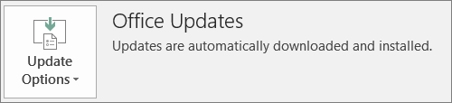

# Przygotowywanie klienta pakietu Office do wdrożenia za pomocą platformy Microsoft 365 dla firmPrepare for Office client deployment by Microsoft 365 for business

Ten artykuł dotyczy usługi Microsoft 365 Business Premium.This article applies to Microsoft 365 Business Premium.

## Przygotowywanie się do automatycznej instalacji aplikacji pakietu Office na komputerach klienckichPrepare to automatically install Office apps to client computers

Za pomocą usługi Microsoft 365 Business Premium możesz automatycznie instalować 32-bitowe aplikacje pakietu Office na komputerach z systemem Windows 10 i być na bieżąco z ich aktualizacjami.You can use Microsoft 365 Business Premium to automatically install the 32-bit Office apps on Windows 10 computers and keep them current with updates.
  
Automatyczna instalacja działa najlepiej, jeśli komputer użytkownika końcowego znajduje się w systemie Windows 10 Business i:Automatic installation works best if the end user's computer is on Windows 10 Business and:
  
- nie ma na nim aplikacji klasycznych pakietu Office (Word, Excel, PowerPoint, Outlook, OneNote, Publisher, Access i usługi OneDrive).Doesn't have existing Office desktop apps (Word, Excel, PowerPoint, Outlook, OneNote, Publisher, Access, and OneDrive).
    
    lubor
    
- jest zainstalowana wersja Szybka instalacja pakietu Office.Has an existing version of Click-to-Run Office installed.
    
Aby sprawdzić, czy korzystasz z wersji Szybka instalacja pakietu Office, w dowolnej aplikacji pakietu Office przejdź do lokalizacji **Plik** \> **Konto** ( **Konto pakietu Office** w programie Outlook).To determine if you have the Click-to-Run version of Office, in any Office app go to **File** \> **Account** ( **Office Account** in Outlook). Jeśli widzisz aktualizacje **pakietu Office,** jak pokazano na poniższej ilustracji, instalacja została wykonana przy użyciu technologii Click-to-Run.If you see **Office Updates** as shown in the following figure, then the installation was done by using Click-to-Run. 
  

  
 **Kto korzysta z tej funkcji****Who benefits from having this feature**
  
Użytkownik końcowy, którego komputer spełnia następujące kryteria:The end user whose PC:
  
- **Ma**  licencję użytkownika systemu Windows 10 Business, aktywną licencję platformy Microsoft 365 dla firm i aktualizację systemu Windows 10 dla twórców oraz jest dołączany do usługi Azure Active Directory.**Has**  a Windows 10 Business user license, an active Microsoft 365 for business license, Windows 10 Creators Update, and is joined to Azure Active Directory. 
    
- **Nie zawiera** 64-bitowych aplikacji pakietu Office (przykład: Word, Excel, PowerPoint).**Doesn't have** 64-bit Office apps (example: Word, Excel, PowerPoint). Jeśli 64-bitowe wersje aplikacji pakietu Office są wymagane, ta funkcja nie jest dobrym rozwiązaniem, ponieważ wyzwalanie 64-bitowej wersji 2016 pakietu Office w wersji Click-to-Run z konsoli administracyjnej platformy Microsoft 365 dla firm nie jest dostępne.If 64-bit Office apps are required, then this feature isn't a good fit because there's no support for triggering a 64-bit 2016 Click-to-Run version of Office from the Microsoft 365 for business admin console. 
    
- **Nie zawiera** żadnych aplikacji autonomicznych Instalatora Windows (MSI) w wersji 2016 (na przykład Visio lub Project).**Doesn't have** any 2016 Windows Installer (MSI) standalone apps (for example, Visio or Project). Usługa Microsoft 365 dla firm uaktualnia pakiet Office do wersji Click-to-Run pakietu Office 2016, która nie działa z aplikacjami autonomicznymi MSI pakietu Office 2016.Microsoft 365 for business upgrades Office to the Click-to-Run version of Office 2016 and that doesn't work with Office 2016 MSI standalone apps. 
    
W poniższej tabeli przedstawiono działania, jakie mogą zostać podjąć użytkownicy końcowi/administratorzy w zależności od stanu ich rozpoczęcia, aby pomyślnie uruchomić 32-bitową wersję Technologii Kliknij, aby uruchomić wdrożenie pakietu Office z konsoli administracyjnej platformy Microsoft 365 dla firm.The following table shows what action the end users/admins may need to take, depending on their beginning state, to have a successful 32-bit Click-to-Run version of Office deployment from the Microsoft 365 for business admin console. 

|Stan początkowy instalacji pakietu OfficeStarting Office install status|Akcja do podjęcia przed zainstalowaniem pakietu Office na platformie Microsoft 365 dla firmAction to take before Microsoft 365 for business Office install|Stan końcowyEnd state|
|:-----|:-----|:-----|
|Brak zainstalowanego pakietu OfficeNo Office suite installed    |BrakNone    |32-bitowy pakiet Office 2016 jest instalowany przy użyciu technologii Click-to-RunOffice 2016 32-bit is installed by using Click-to-Run    |
|Istniejąca 32-bitowa wersja Szybka instalacja pakietu Office (w wersji 2016 lub wcześniejszej) bez aplikacji autonomicznychExisting Click-to-Run 32-bit version of Office (2016 or earlier) and no standalone apps    |BrakNone    |Uaktualnienie do najnowszej 32-bitowej wersji Szybka instalacja pakietu Office 2016 zgodnie z wymaganiami **\***Upgraded to the latest 32-bit Click-to-Run version of Office 2016, as needed **\***   |
|Istniejąca 32-bitowa wersja Click-to-Run pakietu Office i 32-bitowe lub 64-bitowe aplikacje autonomiczne pakietu Office w wersji Click-to-Run (na przykład Visio lub Project)Existing Click-to-Run 32-bit version of Office and Click-to-Run 32-bit or 64-bit standalone Office apps (for example, Visio, Project)    |BrakNone    |Nie wpływa to na aplikacje autonomiczne.Standalone apps aren't affected. Uaktualnienie pakietu do 32-bitowej wersji Szybka instalacja pakietu Office 2016Suite is upgraded to Click-to-Run 32-bit version of Office 2016    |
|Istniejąca 32-bitowa wersja Szybka instalacja pakietu Office i dowolne 32- lub 64-bitowe aplikacje autonomiczne MSI pakietu Office (z wyjątkiem wersji 2016)Existing Click-to-Run 32-bit version of Office and any 32-bit or 64-bit (except 2016) MSI standalone Office apps    |BrakNone    |Nie wpływa to na aplikacje autonomiczne.Standalone apps aren't affected. Uaktualnienie pakietu do 32-bitowej wersji Szybka instalacja pakietu Office 2016Suite is upgraded to Click-to-Run 32-bit version of Office 2016    |
|Dowolna istniejąca 64-bitowa wersja Szybka instalacja pakietu OfficeAny existing Click-to-Run 64-bit version of Office    |Odinstaluj 64-bitowe aplikacje pakietu Office, jeśli można je zamienić na 32-bitowe aplikacje pakietu OfficeUninstall the 64-bit Office apps, if it's OK to replace them with 32-bit Office apps    |Jeśli 64-bitowe wersje aplikacji pakietu Office zostaną usunięte, zostanie zainstalowana 32-bitowa wersja Szybka instalacja pakietu Office 2016If Office 64-bit apps are removed, the Click-to-Run 32-bit version of Office 2016 is installed    |
|Istniejąca instalacja MSI pakietu Office 2016 z aplikacjami autonomicznymi lub bez nichAn existing MSI install of Office 2016 with or without standalone apps    |Odinstalowanie pakietu Office 2016 w wersji MSI.Uninstall MSI Office 2016.    |Zainstalowana 32-bitowa wersja Szybka instalacja pakietu Office 2016. Brak zmian w aplikacjach autonomicznychClick-to-Run 32-bit version of Office 2016 is installed. No change to standalone apps    |
|Istniejąca instalacja MSI pakietu Office 2013 (lub starszego) i/lub aplikacji autonomicznych pakietu OfficeExisting MSI install of Office 2013 (or earlier) and/or standalone Office apps    |BrakNone    |32-bitowa wersja Szybka instalacja pakietu Office 2016 i istniejąca wcześniej instalacja MSI pakietu Office (z aplikacjami autonomicznymi) istnieją równolegleClick-to-Run 32-bit version of Office 2016 with the pre-existing MSI Office install (and standalone apps) exist side-by-side    |
||||
   
 **(\*) Uwaga:** Nie można przeprowadzić uaktualnienia do 32-bitowej wersji Szybka instalacja pakietu Office 2016 z powodu znanego błędu.**(\*) Note:** Does not upgrade to Click-to-Run 32-bit version of Office 2016 due to a known bug. Trwa prace nad poprawą.A fix is in progress. 
  
