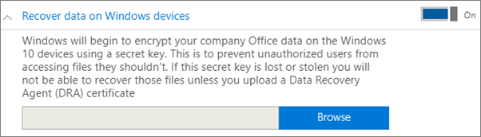
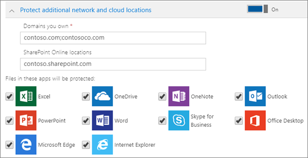

# Konfigurowanie lub edytowanie ustawień ochrony aplikacji dla urządzeń z systemem Windows 10

Ten artykuł dotyczy usługi Microsoft 365 Business Premium.

## Edytowanie zasad zarządzania aplikacją dla systemu Windows 10

1. Przejdź do centrum administracyjnego w stronie <a href="https://go.microsoft.com/fwlink/p/?linkid=837890" target="_blank">https://admin.microsoft.com</a> .     
2. W lewym okienku narracji wybierz pozycję **Zasady** \> **dotyczące urządzeń.**
1. Wybierz istniejące zasady aplikacji systemu Windows, a następnie pozycję **Edytuj**.
1. Wybierz **pozycję Edytuj** obok ustawienia, które chcesz zmienić, a następnie wybierz pozycję **Zapisz**.

## Tworzenie zasad zarządzania aplikacjami dla systemu Windows 10

Jeśli użytkownicy mają urządzenia osobiste z systemem Windows 10, na których wykonują zadania służbowe, możesz również chronić dane na tych urządzeniach.
  
1. Przejdź do centrum administracyjnego w stronie <a href="https://go.microsoft.com/fwlink/p/?linkid=837890" target="_blank">https://admin.microsoft.com</a> . 
2. W lewym okienku narracji wybierz pozycję **Urządzenia Zasady** \>  \> **Dodaj**.
3. W okienku **Dodawanie zasad** wprowadź unikatową nazwę dla zasad. 
4. W sekcji **Typ zasad** wybierz pozycję **Zarządzanie aplikacjami dla systemu Windows 10**.
5. W **obszarze Typ urządzenia** wybierz pozycję **Osobiste** lub **Własność firmy**.
6. Opcja **Szyfruj pliki służbowe** zostanie włączona automatycznie. 
7. Jeśli nie chcesz, aby użytkownicy mogli zapisywać pliki służbowe na swoich komputerach, **włącz** ustawienie **Uniemożliw użytkownikom kopiowanie danych firmy do plików osobistych i wymuś na nich zapisywanie plików służbowych w usłudze OneDrive dla Firm**. 
9. Rozwiń **temat Odzyskiwanie danych na urządzeniach z systemem Windows.** Zalecamy jej włączenie **.**
    Aby móc przejść do lokalizacji certyfikatu agenta odzyskiwania danych, musisz najpierw go utworzyć. Aby uzyskać instrukcje, zobacz Tworzenie i weryfikowanie certyfikatu agenta odzyskiwania danych systemu szyfrowania plików [(EFS).](/windows/security/information-protection/windows-information-protection/create-and-verify-an-efs-dra-certificate)
    
    Domyślnie pliki robocze są szyfrowane przy użyciu klucza tajnego, który jest przechowywany na urządzeniu i skojarzony z profilem użytkownika. Tylko użytkownik może otwierać i odszyfrowywać plik. Jednak w razie utraty urządzenia lub usunięcia użytkownika plik może utknąć w stanie zaszyfrowania. Administrator może odszyfrować plik za pomocą certyfikatu agenta odzyskiwania danych (DRA).
    
    
  
10. Rozwiń **pozycję Chroń dodatkowe** lokalizacje sieciowe i w chmurze, jeśli chcesz dodać dodatkowe domeny lub lokalizacje usługi SharePoint Online, aby mieć pewność, że pliki we wszystkich wymienionych aplikacjach są chronione. Jeśli dla każdego pola trzeba wprowadzić więcej niż jeden element, użyj średnika (;) między elementami.
    
    
  
11. Next decide **Who will get these settings?** If you don't want to use the default **All Users** security group, choose **Change**, choose the security groups who will get these settings \> **Select**.
12. Na koniec wybierz przycisk **Dodaj**, aby zapisać zasady i zastosować je na urządzeniach.