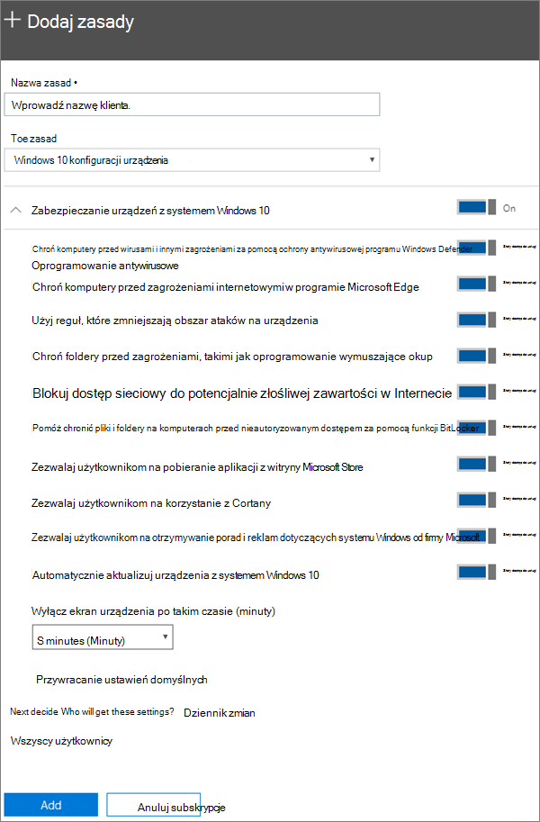

# Edytowanie lub tworzenie ustawień ochrony urządzeń dla komputerów PC z systemem Windows 10Edit or create device protection settings for Windows 10 PCs

Ten artykuł dotyczy programu Microsoft 365 Business Premium.This article applies to Microsoft 365 Business Premium.

Po ustawieniu domyślnych ustawień ochrony systemu Windows na stronie Konfiguracja możesz dodać nowe, które będą dotyczyć wszystkich użytkowników lub zestawu użytkowników.After you have set set up default Windows protection settings on the Setup page, you can add new ones that apply to either all users, or a set of users. Możesz również edytować dowolne z utworzonych przez siebie elementów.You can also edit any of the ones you have created.

## Tworzenie ustawień ochrony dla urządzeń z systemem Windows 10Create protection settings for Windows 10 devices

Zobacz klip wideo dotyczący zabezpieczania urządzeń z systemem Windows 10 przy użyciu usługi Microsoft 365 Business Premium:View a video on how to secure Windows 10 devices with Microsoft 365 Business Premium:
  
> [!VIDEO https://www.microsoft.com/videoplayer/embed/a5734146-620a-4cec-8618-536b3ca37972?autoplay=false]
  
1. Przejdź do centrum administracyjnego <a href="https://go.microsoft.com/fwlink/p/?linkid=837890" target="_blank">https://admin.microsoft.com</a> .Go to the admin center at <a href="https://go.microsoft.com/fwlink/p/?linkid=837890" target="_blank">https://admin.microsoft.com</a>. 
2. Na lewym pasku nawigacyjnym wybierz pozycję Zasady dotyczące **urządzeń** , \> **Policies** \> **Dodaj**.On the left nav, choose **Devices** \> **Policies** \> **Add**.
3. W okienku **Dodawanie zasad** wprowadź unikatową nazwę dla zasad.On the **Add policy** pane, enter a unique name for this policy. 
4. W sekcji **Typ zasad** wybierz opcję **Konfiguracja urządzeń z systemem Windows 10**.Under **Policy type**, choose **Windows 10 Device Configuration**.
5. Expand **Secure Windows 10 Devices** \> configure the settings how you would like.Expand **Secure Windows 10 Devices** \> configure the settings how you would like. Aby uzyskać więcej informacji, zobacz [dostępne ustawienia](#available-settings).For more information, see [Available settings](#available-settings). 
    
    Aby zresetować ustawienia do wartości domyślnych, w dowolnej chwili możesz użyć linku **Resetuj ustawienia domyślne**.You can always use the **Reset default settings** link to return to the default setting. 
    
    
  
6. Next decide **Who will get these settings?** If you don't want to use the default **All users** security group, Choose **Change**, search for the security group who will get these settings \> **Select**.Next decide **Who will get these settings?** If you don't want to use the default **All users** security group, Choose **Change**, search for the security group who will get these settings \> **Select**.
7. Na koniec wybierz przycisk **Gotowe**, aby zapisać zasady i zastosować je na urządzeniach.Finally, choose **Done** to save the policy, and assign it to devices. 

## Edytowanie ustawień ochrony systemu Windows 10Edit Windows 10 protection settings
 
1. Przejdź do centrum administracyjnego <a href="https://go.microsoft.com/fwlink/p/?linkid=837890" target="_blank">https://admin.microsoft.com</a> .Go to the admin center at <a href="https://go.microsoft.com/fwlink/p/?linkid=837890" target="_blank">https://admin.microsoft.com</a>.     
2. Na lewym pasku nawigacyjnym wybierz pozycję Zasady dotyczące **urządzeń** \> **Policies** .On the left nav, choose **Devices** \> **Policies** .
1. Wybierz istniejące zasady urządzeń z systemem Windows, a następnie pozycję **Edytuj**.Choose an existing Windows device policy and then **Edit**.
1. Wybierz pozycję **Edytuj** obok ustawienia, które chcesz zmienić, a następnie kliknij przycisk **Zapisz**.Choose **Edit** next to a setting you want to change and then **Save**.

## Dostępne ustawieniaAvailable settings

Domyślnie wszystkie ustawienia są **Włączone**.By default all settings are **On**. Dostępne są następujące ustawienia.The following settings are available.
  
Aby uzyskać więcej informacji, zobacz [jak funkcje ochrony w programie Microsoft 365 Premium mapują się na ustawienia usługi Intune](map-protection-features-to-intune-settings.md).For more information, see [How do protection features in Microsoft 365 Premium map to Intune settings](map-protection-features-to-intune-settings.md). 
  
|||
|:-----|:-----|
|UstawienieSetting    |OpisDescription    |
|Chroń komputery przed wirusami i innymi zagrożeniami za pomocą ochrony antywirusowej programu Windows DefenderHelp protect PCs from viruses and other threats using Windows Defender Antivirus    |Wymaga włączenia programu antywirusowego Windows Defender w celu ochrony komputerów przed zagrożeniami związanymi z połączeniem z Internetem.Requires that Windows Defender Antivirus is turned on to protect PCs from the dangers of being connected to the internet.    |
|Chroń komputery przed zagrożeniami internetowymi w programie Microsoft EdgeHelp protect PCs from web-based threats in Microsoft Edge    |Włącza w programie Microsoft Edge ustawienia ułatwiające ochronę użytkowników przed złośliwymi witrynami i złośliwą zawartością do pobrania.Turns on settings in Edge that help protect users from malicious sites and downloads.    |
|Użyj reguł, które zmniejszają obszar ataków na urządzeniaUse rules that reduce the attack surface of devices    |Gdy zmniejszanie obszaru ataków jest włączone, pomaga blokować akcje i aplikacje zwykle używane przez złośliwe oprogramowanie do infekowania urządzeń. To ustawienie jest dostępne tylko wtedy, gdy jest włączona ochrona antywirusowa programu Windows Defender. Zobacz [Zmniejszanie obszarów ataków](https://docs.microsoft.com/windows/security/threat-protection/microsoft-defender-atp/exploit-protection), aby dowiedzieć się więcej.  When turned On, attack surface reduction helps block actions and apps typically used by malware to infect devices. This setting is only available if Windows Defender Antivirus is set to On. See [Reduce attack surfaces](https://docs.microsoft.com/windows/security/threat-protection/microsoft-defender-atp/exploit-protection) to learn more.    |
|Chroń foldery przed zagrożeniami, takimi jak oprogramowanie wymuszające okupProtect folders from threats such as ransomware    |To ustawienie używa kontrolowanego dostępu do folderów w celu ochrony danych firmy przed modyfikacją przez podejrzane lub złośliwe aplikacje, takie jak oprogramowanie wymuszające okup.This setting uses controlled folder access to protect company data from modification by suspicious or malicious apps, such as ransomware. Tego typu aplikacje mają zablokowaną możliwość wprowadzania zmian w chronionych folderach.These types of apps are blocked from making changes in protected folders. To ustawienie jest dostępne tylko wtedy, gdy jest włączona ochrona antywirusowa programu Windows Defender.This setting is only available if Windows Defender Antivirus is set to On. Zobacz [chronienie folderów za pomocą funkcji kontrolowany dostęp do folderu](https://docs.microsoft.com/mem/configmgr/protect/deploy-use/create-deploy-exploit-guard-policy#bkmk_CFA) , aby dowiedzieć się więcej.See [Protect folders with Controlled folder access](https://docs.microsoft.com/mem/configmgr/protect/deploy-use/create-deploy-exploit-guard-policy#bkmk_CFA) to learn more.    |
|Blokuj dostęp sieciowy do potencjalnie złośliwej zawartości w InterneciePrevent network access to potentially malicious content on the Internet    |To ustawienie służy do blokowania wychodzących połączeń użytkowników z niewielką witryną internetową, które mogą prowadzić do wyłudzania informacji, wykorzystywania lub innej złośliwej zawartości.Use this setting to block outbound user connections to low-reputation Internet locations that may host phishing scams, exploits, or other malicious content. To ustawienie jest dostępne tylko wtedy, gdy program antywirusowy Windows Defender jest ustawiony na wartość **włączone**.This setting is only available if Windows Defender Antivirus is set to **On**. Aby uzyskać więcej informacji, zobacz [chronienie sieci](https://docs.microsoft.com/windows/security/threat-protection/windows-defender-antivirus/configure-real-time-protection-windows-defender-antivirus).For more information, see [Protect your network](https://docs.microsoft.com/windows/security/threat-protection/windows-defender-antivirus/configure-real-time-protection-windows-defender-antivirus).    |
|Pomóż chronić pliki i foldery na komputerach przed nieautoryzowanym dostępem za pomocą funkcji BitLockerHelp protect files and folders on PCs from unauthorized access with BitLocker    |Funkcja BitLocker chroni dane przez zaszyfrowanie dysków twardych komputera i zapewnianie ochrony przed ujawnieniem danych w razie zagubienia lub kradzieży komputera.Bitlocker protects data by encrypting the computer hard drives and protect against data exposure if a computer is lost or stolen. Aby uzyskać więcej informacji, zobacz [często zadawane pytania dotyczące funkcji BitLocker](https://go.microsoft.com/fwlink/?linkid=871000).For more information, see [Bitlocker FAQ](https://go.microsoft.com/fwlink/?linkid=871000).    |
|Zezwalaj użytkownikom na pobieranie aplikacji z witryny Microsoft StoreAllow users to download apps from Microsoft Store    |Pozwala użytkownikom pobierać i instalować aplikacje z witryny Microsoft Store. Do aplikacji tych należą zarówno gry, jak i narzędzia biurowe, więc zostawiamy to ustawienie **włączone**, ale możesz je wyłączyć w celu dodatkowego zwiększenia bezpieczeństwa.  Lets users download and install apps from the Microsoft Store. Apps include everything from games to productivity tools, so we leave this setting **On**, but you can turn it off for extra security.    |
|Zezwalaj użytkownikom na korzystanie z CortanyAllow users to access Cortana    |Cortana może być bardzo pomocna.Cortana can be very helpful! Cortana może włączać lub wyłączać ustawienia dla Ciebie, nadawać wskazówki, a także upewnić się, że masz czas na terminy, więc to ustawienie jest domyślnie **włączone** .Cortana can turn settings on or off for you, give directions, and make sure you're on time for appointments, so we keep this setting **On** by default.    |
|Zezwalaj użytkownikom na otrzymywanie porad i reklam dotyczących systemu Windows od firmy MicrosoftAllow users to receive Windows tips and advertisements from Microsoft    |Porady dotyczące systemu Windows mogą być przydatne i ułatwiać użytkownikom zapoznawanie się nowymi funkcjami.Windows tips can be handy and help orient users when new features are released.    |
|Automatycznie aktualizuj urządzenia z systemem Windows 10Keep Windows 10 devices up to date automatically    |Zapewnia, że urządzenia z systemem Windows 10 automatycznie otrzymują najnowsze aktualizacje.Makes sure that Windows 10 devices automatically receive the latest updates.    |
|Wyłącz ekran urządzenia po takim czasie bezczynnościTurn off device screen when idle for this amount of time    |Zapewnia bezpieczeństwo danych firmowych podczas bezczynności użytkownika. Jeśli użytkownik pracuje w miejscu publicznym, na przykład kawiarni, i odejdzie na chwilę od urządzenia lub skupi uwagę na czymś innym, przypadkowe osoby mogą obejrzeć zawartość ekranu. To ustawienie pozwala kontrolować czas bezczynności użytkownika, po którym ekran zostanie wyłączony.Makes sure that company data is protected if a user is idle. A user may be working in a public location, like a coffee shop, and step away or be distracted for just a moment, leaving their device vulnerable to random glances. This setting lets you control how long the user can be idle before the screen shuts off.    |
