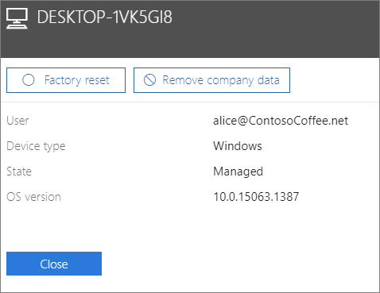

# Usuwanie firmowych danych z urządzeń

## Usuwanie firmowych danych

Za pomocą usługi Microsoft 365 dla firm można usuwać dane firmowe użytkowników na swoich [urządzeniach](app-protection-settings-for-android-and-ios.md) lub [komputerach z systemem Windows](protection-settings-for-windows-10-devices.md) chronionych przez usługę Microsoft 365. **Jeśli usuniesz firmowe dane z urządzenia, nie będzie można ich później przywrócić**. 
  
1. Przejdź do centrum administracyjnego w <a href="https://go.microsoft.com/fwlink/p/?linkid=837890" target="_blank">https://admin.microsoft.com</a> .
    
2. Po lewej stronie urządzenia wybierz pozycję **Zarządzanie** \> **urządzeniami**.  
  
3. Na stronie **Zarządzanie** wybierz lub wyszukaj użytkownika, który ma usunąć dane, które chcesz usunąć, i wybierz nazwę. 
    
4. W następnym okienku wybierz urządzenie lub urządzenia z listy **Urządzenia.** W okienku urządzenia, które się otworzy, możesz zresetować urządzenie do ustawień fabrycznych lub usunąć dane firmowe, w zależności od typu urządzenia. 
    
    
  
5. W okienku potwierdzenia wybierz pozycję **Potwierdź** \> **zamknięcie**.
    

