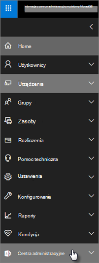

# Funkcje zabezpieczeń i zgodności programu Microsoft 365 Business PremiumMicrosoft 365 Business Premium security and compliance features

Program Microsoft 365 Business Premium oferuje uproszczone funkcje zabezpieczeń, które pomagają chronić dane na komputerach, telefonach i tabletach.Microsoft 365 Business Premium offers simplified security features to help safeguard your data on PCs, phones, and tablets.
    
## Funkcje zabezpieczeń centrum administracyjnego programu Microsoft 365Microsoft 365 admin center security features

W centrum administracyjnym można zarządzać wieloma funkcjami zabezpieczeń programu Microsoft 365 Business Premium, co zapewnia uproszczony sposób włączania i wyłączania tych funkcji.You can manage many of the Microsoft 365 Business Premium security features in the admin center, which gives you a simplified way to turn these features on or off. W centrum administracyjnym możesz wykonać następujące czynności:In the admin center, you can do the following:
  
- [Ustawianie ustawień zarządzania aplikacjami dla urządzeń z systemem Android lub iOS](app-protection-settings-for-android-and-ios.md) .[Set application management settings for Android or iOS devices](app-protection-settings-for-android-and-ios.md) . 
    
    Te ustawienia obejmują usuwanie plików z nieaktywnego urządzenia po określonym okresie, szyfrowanie plików służbowych wymagające użytkownikom ustawienia numeru PIN itd.These settings include deleting files from an inactive device after a set period, encrypting work files, requiring that users set a PIN, and so on.
    
- [Ustawianie ustawień ochrony aplikacji dla urządzeń z systemem Windows 10](protection-settings-for-windows-10-devices.md) .[Set application protection settings for Windows 10 devices](protection-settings-for-windows-10-devices.md) . 
    
    Te ustawienia mogą być stosowane do danych firmowych zarówno na urządzeniach należących do firmy, jak i osobistych.These settings can be applied to company data on both company-owned, or personally owned devices.
    
- [Ustawianie ustawień ochrony urządzeń dla urządzeń z systemem Windows 10](protection-settings-for-windows-10-pcs.md) .[Set device protection settings for Windows 10 devices](protection-settings-for-windows-10-pcs.md) . 
    
    Szyfrowanie [funkcji BitLocker](https://go.microsoft.com/fwlink/p/?linkid=871405) można włączyć, aby chronić dane na wypadek, gdyby urządzenie zostało zgubione lub skradzione, i włączyć funkcję [Windows Exploit Guard](https://docs.microsoft.com/windows/security/threat-protection/microsoft-defender-atp/enable-exploit-protection) , aby zapewnić zaawansowaną ochronę przed używaniem oprogramowania wymuszającego okup.You can enable [BitLocker](https://go.microsoft.com/fwlink/p/?linkid=871405) encryption to help protect data in case a device is lost or stolen, and enable [Windows Exploit Guard](https://docs.microsoft.com/windows/security/threat-protection/microsoft-defender-atp/enable-exploit-protection) to provide advanced protection against ransomware. 
    
- [Usuwanie firmowych danych z urządzeńRemove company data from devices](remove-company-data.md)
    
    Możesz zdalnie wyczyścić dane firmy, jeśli urządzenie zostanie zgubione, skradzione lub pozostawiono firmie.You can remotely wipe company data if a device is lost, stolen, or an employee leaves your company.
    
- [Przywróć ustawienia fabryczne urządzeń z systemem Windows 10](reset-devices-to-factory-settings.md) .[Reset Windows 10 devices to their factory settings](reset-devices-to-factory-settings.md) . 
    
    Możesz zresetować wszystkie urządzenia z systemem Windows 10, do których zastosowano ustawienia ochrony urządzeń.You can reset any Windows 10 devices that have device protection settings applied to them.
    
## Dodatkowe funkcje zabezpieczeńAdditional security features 

W programie Microsoft 365 Business Premium udostępniono zaawansowane funkcje ułatwiające ochronę firmy przed zagrożeniami związanymi z Cyber i ochroną poufnych informacji.Advanced features in Microsoft 365 Business Premium are available to help you protect your business against cyber-threats and safeguard sensitive information.
  
- **[Microsoft Defender dla Office 365](https://docs.microsoft.com/microsoft-365/security/office-365-security/office-365-atp)****[Microsoft Defender for Office 365](https://docs.microsoft.com/microsoft-365/security/office-365-security/office-365-atp)**
    
    Program Microsoft Defender dla Office 365 ułatwia ochronę Twojej firmy przed wyrafinowanymi atakami wyłudzania informacji i oprogramowania wymuszającego okup, mającymi na celu złamanie informacji o pracownikach lub klientach.Microsoft Defender for Office 365 helps guard your business against sophisticated phishing and ransomware attacks designed to compromise employee or customer information. Funkcje obejmują:Features include:
    
  - Zaawansowanego skanowania załączników i analizy z obsługą AI do wykrywania i odrzucania niebezpiecznych wiadomości.Sophisticated attachment scanning and AI-powered analysis to detect and discard dangerous messages.
    
  - Automatyczne sprawdzanie łączy w wiadomości e-mail w celu oceny, czy są one częścią procedury wyłudzania informacji.Automatic checks of links in email to assess if they're part of a phishing scheme. Dzięki temu można bezpiecznie uzyskiwać dostęp do niebezpiecznych witryn internetowych.This keeps you safe from accessing unsafe websites.

- **[Pełne funkcje usługi Intune w portalu Azure](https://go.microsoft.com/fwlink/p/?linkid=871403)****[The full capabilities of Intune in the Azure portal](https://go.microsoft.com/fwlink/p/?linkid=871403)**
    
    Uzyskiwanie dostępu do centrum administracyjnego usługi Intune w portalu Azure umożliwia konfigurowanie dodatkowych funkcji zabezpieczeń, takich jak zarządzanie urządzeniami MacOS, iPhone i urządzeniami z systemem Android oraz zaawansowane zarządzanie urządzeniami z systemem Windows, które nie są dostępne za pośrednictwem Centrum administracyjnego usługi Microsoft 365.Accessing the Intune admin center in the Azure portal allows you to set up additional security features, such as management of MacOS devices, iPhone, and Android devices, along with advanced device management for Windows, that aren't available through Microsoft 365 admin center.
- **Taki sam [dostęp warunkowy](https://docs.microsoft.com/azure/active-directory/conditional-access/overview) jak plan usługi Azure AD Premium w wersji P1****Same [Conditional Access](https://docs.microsoft.com/azure/active-directory/conditional-access/overview) as Azure AD Premium P1 plan**

    Dostęp warunkowy ułatwia ochronę organizacji przed ryzykiem logowania, próbuje uzyskać dostęp do nieoczekiwanych sieci lub ustawień regionalnych, próbuje uzyskać dostęp do różnych typów urządzeń z czynnikami ryzyka itd.Conditional Access can help protect your organization from sign-in risk, access attempts from an unexpected network or locale, access attempts from risky device types, and so on. Zasady dostępu warunkowego są wymuszane po zakończeniu pierwszego uwierzytelniania, a w celu określenia, czy próba uzyskania dostępu powinna zostać zatwierdzona, odrzucona lub jeśli jest wymagany (na przykład druga forma identyfikacji), są używane sygnały z pierwszego zdarzenia uwierzytelniania.Conditional Access policies are enforced after the first authentication is completed, and it uses signals from the first authentication event to determine if the attempted access should be approved, denied, or if more proof (such as a second form of identification) is required.

    Uwzględnione funkcje dostępu warunkowego są następujące:The conditional access features included are:

    - Dostęp na podstawie nazwy użytkownika, grupy i roliAccess based on username, group, and role
    - Dostęp [na podstawie aplikacji](https://docs.microsoft.com/azure/active-directory/conditional-access/app-based-conditional-access)Access [based on an app](https://docs.microsoft.com/azure/active-directory/conditional-access/app-based-conditional-access) 
    - [Dostęp na podstawie lokalizacji](https://docs.microsoft.com/azure/active-directory/authentication/howto-registration-mfa-sspr-combined#conditional-access-policies-for-combined-registration);  Zezwalaj na dostęp tylko z zaufanych zakresów IP lub określonych krajów[Access based on location](https://docs.microsoft.com/azure/active-directory/authentication/howto-registration-mfa-sspr-combined#conditional-access-policies-for-combined-registration);  only allow access from trusted IP ranges or specific countries 
    - Wymagaj uwierzytelniania wieloskładnikowego w programie AccessRequire MFA for access
    - Blokowanie dostępu do aplikacji korzystających ze [starszych wersji uwierzytelniania](https://docs.microsoft.com/azure/active-directory/conditional-access/block-legacy-authentication)Block access to apps that use [legacy authentication](https://docs.microsoft.com/azure/active-directory/conditional-access/block-legacy-authentication)
    - Wymagaj aplikacji TP Użyj usługi [Intune App Protection](https://docs.microsoft.com/azure/active-directory/conditional-access/app-protection-based-conditional-access)Require apps tp use [Intune app protection](https://docs.microsoft.com/azure/active-directory/conditional-access/app-protection-based-conditional-access)
    - Niestandardowe uwierzytelnianie, takie jak MFA z dostawcami innych firm, na przykład DUO.Custom authentication such as MFA with third-party providers, for example DUO.
   
    Inne funkcje:Other features:
    - Samoobsługowe [Resetowanie hasła](https://docs.microsoft.com/azure/active-directory/authentication/concept-sspr-customization) dla hybrydowej usługi Azure AD[Self-service password reset](https://docs.microsoft.com/azure/active-directory/authentication/concept-sspr-customization) for hybrid Azure AD
    
## Funkcje zgodnościCompliance features

Abonament Microsoft 365 Business Premium zawiera funkcje, które ułatwiają zachowanie zgodności i standardów wykonawczych.Your Microsoft 365 Business Premium subscription includes features that help you maintain compliance and regulatory standards.

- **[Omówienie zasad ochrony przed utratą danych](https://docs.microsoft.com/microsoft-365/compliance/data-loss-prevention-policies)** (DLP).**[Overview of data loss prevention policies](https://docs.microsoft.com/microsoft-365/compliance/data-loss-prevention-policies)** (DLP). 
    
    Ustawienia DLP można skonfigurować w celu automatycznego wykrywania poufnych informacji, takich jak numery kart kredytowych, numerów PESEL i tak dalej, aby zapobiec przypadkowemu udostępnieniu poza firmą.You can set up DLP to automatically detect sensitive information, like credit card numbers, social security numbers, and so on, to prevent their inadvertent sharing outside your company.
    
- **[Exchange Online — archiwum](https://products.office.com/exchange/microsoft-exchange-online-archiving-email)****[Exchange Online Archiving](https://products.office.com/exchange/microsoft-exchange-online-archiving-email)**
    
    Licencja archiwizowania usługi Exchange Online umożliwia łatwe archiwizowanie wiadomości za pomocą ciągłej kopii zapasowej danych.Exchange Online Archiving license enables messages to be easily archived with continuous data backup. Umożliwia przechowywanie wszystkich wiadomości e-mail użytkownika, w tym elementów usuniętych, na wypadek, gdyby były one wymagane później do odnalezienia lub przywrócenia.It stores all of a user's emails, including deleted items, in case they're needed later for discovery or restoration. Ponadto można korzystać z różnych zasad przechowywania w celu zachowania danych wiadomości e-mail dotyczących czynności sądowych, zbierania elektronicznych materiałów dowodowych lub spełniania wymagań dotyczących zgodności.Additionally, you can use different retention policies to preserve email data for litigation holds, eDiscovery, or to meet compliance requirements.
    
- **[Etykiety wrażliwości](https://docs.microsoft.com/microsoft-365/compliance/sensitivity-labels)****[Sensitivity labels](https://docs.microsoft.com/microsoft-365/compliance/sensitivity-labels)**

   Pakiet Microsoft 365 Business Premium zawiera wszystkie funkcje [usługi Azure Information Protection Plan 1](https://go.microsoft.com/fwlink/p/?linkid=871407).Microsoft 365 Business Premium includes all the features of [Azure Information Protection Plan 1](https://go.microsoft.com/fwlink/p/?linkid=871407). Dzięki temu planowi można tworzyć **etykiety czułe** , które umożliwiają kontrolowanie dostępu do poufnych informacji w wiadomościach e-mail i dokumentach za pomocą formantów, takich jak "nie przesyłaj dalej" i "nie Kopiuj".With this plan, you can create **Sensitivity labels** that allow you to control access to sensitive information in email and documents, with controls like "Do not forward" and "Do not copy." Informacje poufne można także sklasyfikować jako "poufne" i określić sposób udostępniania informacji klasyfikowanych na zewnątrz i w firmie.You can also classify sensitive information as "Confidential" and specify how classified information can be shared outside and inside the business. W przypadku firm szyfrowanie jest łatwe w obsłudze w wiadomościach e-mail i dokumentach, aby zapewnić prywatność informacji.Enterprise-grade encryption is easy to apply to email and documents to keep your information private. Możesz również zainstalować dodatek klienta usługi Azure Information Protection dla pakietu Office.You can also install the Azure Information Protection client add-in for Office apps. Aby uzyskać więcej informacji, zobacz [Klient usługi Azure Information Protection Unified etykietowanie klientów](https://docs.microsoft.com/azure/information-protection/rms-client/unifiedlabelingclient-version-release-history).For more information, see [Azure Information Protection unified labeling client](https://docs.microsoft.com/azure/information-protection/rms-client/unifiedlabelingclient-version-release-history). Aby uzyskać etykiety wrażliwości, zainstaluj **AzInfoProtection_UL.exe**.For Sensitivity labels, install the **AzInfoProtection_UL.exe**.

Tymi funkcjami można zarządzać w &amp; Centrum zgodności z zabezpieczeniami oraz w centrum administracyjnym usługi Intune.You can manage these features in the Security &amp; Compliance center and the Intune admin center. W czasie, gdy uproszczone kontrolki zostaną dodane do centrum administracyjnego usługi Microsoft 365.Over time the simplified controls will be added to the Microsoft 365 admin center.
  
    
## Często zadawane pytaniaFAQ

 ### Czy te funkcje zabezpieczeń są dostępne na wszystkich rynkach?Are these security features available in all markets?
  
Tak, te funkcje są dostępne na wszystkich rynkach, na których jest sprzedawany program Microsoft 365 Business Premium.Yes, these features are available in all markets where Microsoft 365 Business Premium is sold.
  
### Jak znaleźć &amp; Centrum zgodności zabezpieczeń?How do I find the Security &amp; Compliance center?
  
1. [Zaloguj się do aplikacji Microsoft 365 Business Premium](https://portal.microsoft.com/) , korzystając z poświadczeń administratora.[Sign in to Microsoft 365 Business Premium](https://portal.microsoft.com/) by using your admin credentials. 
    
2. W lewym okienku nawigacji znajdź pozycję **centra administracyjne** i rozwiń ją.In the left nav, locate **Admin centers** and expand it. 
    
    
  
3. Wybierz **pozycję &amp; zgodność zabezpieczeń** , aby przejść do &amp; Centrum zgodności z zabezpieczeniami.Choose **Security &amp; Compliance** to go to Security &amp; compliance center.
