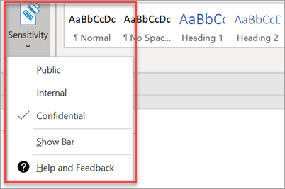

# Konfigurowanie funkcji zgodnościSet up compliance features

Program Microsoft 365 Business Premium zawiera funkcje chroniące dane i urządzenia, a ponadto ułatwia ochronę danych poufnych przez klientów.Your Microsoft 365 Business Premium comes with features to protect your data and devices, and help you keep your and your customers' sensitive information secure.

## Konfigurowanie funkcji DLPSet up DLP features

Zobacz [Tworzenie zasad DLP na podstawie szablonu](https://docs.microsoft.com/microsoft-365/compliance/create-a-dlp-policy-from-a-template) , aby zapoznać się z przykładem konfigurowania zasad w celu ochrony przed utratą danych osobowych.See [Create a DLP policy from a template](https://docs.microsoft.com/microsoft-365/compliance/create-a-dlp-policy-from-a-template) for an example on how to set up a policy to protect against protect loss of personal data. 
  
W ramach DLP jest dostępnych wiele gotowych szablonów zasad dla wielu różnych ustawień regionalnych.DLP comes with many ready-to-use policy templates for many different locales. Na przykład dane finansowe Australii, stan danych osobowych w Kanadzie, dane finansowe USA itd.For example, Australia Financial Data, Canada Personal Information Act, U.S. Financial Data, and so on. Zobacz [, co zawiera szablon zasady DLP,](https://docs.microsoft.com/microsoft-365/compliance/what-the-dlp-policy-templates-include) Aby uzyskać pełną listę.See [What the DLP policy templates include](https://docs.microsoft.com/microsoft-365/compliance/what-the-dlp-policy-templates-include) for a full list. Wszystkie te szablony można włączyć podobnie jak w przypadku szablonu dane OSOBowe.All of these templates can be enabled similar to the PII template example. 
  
## Konfigurowanie przechowywania poczty e-mail przy użyciu aplikacji Exchange Online ArchiwizujSet up email retention with Exchange Online Archiving

 Funkcje licencji **usługi Exchange Online do archiwizacji** ułatwiają zachowanie zgodności i standardów normatywnych przez zachowywanie zawartości wiadomości E-mail dla zbierania elektronicznych materiałów dowodowych.**Exchange Online Archiving** license features help maintain compliance and regulatory standards by preserving email content for eDiscovery. Pomaga to w ograniczeniu ryzyka, jeśli istnieje sprawność, a także umożliwia odzyskanie danych po naruszeniu zabezpieczeń lub w przypadku konieczności odzyskania elementów usuniętych.It also helps reduce your risk if there is a lawsuit, and provides a way to recover data after a security breach or when you need to recover deleted items. W celu zachowania całej zawartości użytkownika lub użycia zasad przechowywania w celu dostosowania tego, co chcesz zachować, można użyć funkcji wstrzymania płatności sądowych.You can use litigation hold to preserve all of a user's content, or use retention policies to customize what you want to preserve.
  
**Przechowywanie sporów sądowych:** Całą zawartość skrzynki pocztowej, w tym usunięte elementy, można zachować, umieszczając całą skrzynkę pocztową użytkownika w ramach blokady sądowej.**Litigation hold:** You can preserve all mailbox content including deleted items by putting a user's entire mailbox on litigation hold. 
    
Aby umieścić skrzynkę pocztową w ramach blokady sądowej, w centrum administracyjnym:To place a mailbox on litigation hold, in the Admin center:
    
1. W lewym okienku nawigacji przejdź do obszaru **Użytkownicy** \> **aktywni** użytkownicy.In the left nav, go to **Users** \> **Active users**.
    
2. Wybierz użytkownika, którego skrzynkę pocztową chcesz umieścić w ramach blokady sądowej.Select a user whose mailbox you want to place on litigation hold. W okienku użytkownika rozwiń pozycję **Ustawienia poczty** i obok pozycji **więcej ustawień** wybierz pozycję **Edytuj właściwości serwera Exchange**.In the user pane, expand **Mail settings** , and next to **More settings** , choose **Edit Exchange properties**.
    
3. Na stronie Skrzynka pocztowa użytkownika wybierz pozycję \* \* Funkcje skrzynki pocztowej \* \* w lewym obszarze nawigacyjnym, a następnie wybierz link **Włącz** w obszarze **powstrzymywania sporu**.On the mailbox page for the user, choose \*\* mailbox features \*\* on the left nav, and then choose the **Enable** link under **Litigation hold**.
    
4. W oknie dialogowym **zawieszanie sporu** możesz określić czas trwania zadania sądowego w polu **czas trwania blokady sądowej** .In the **litigation hold** dialog box, you can specify the litigation hold duration in the **Litigation hold duration** field. Pozostaw pole puste, jeśli chcesz zawiesić blokadę.Leave the field empty if you want to place an infinite hold. Możesz również dodać notatki i skierować właściciela skrzynki pocztowej do witryny sieci Web, aby dowiedzieć się więcej o zawieszeniu sporu.You can also add notes and direct the mailbox owner to a website you might have to explain more about the litigation hold. \>**Zapisz**.\> **Save**.
    
**Zachowanie:** Możesz włączyć niestandardowe zasady przechowywania, na przykład w celu zachowania określonej ilości czasu lub trwałego usunięcia zawartości na końcu okresu przechowywania.**Retention:** You can enable customized retention policies, for example, to preserve for a specific amount of time or delete content permanently at the end of the retention period. Aby dowiedzieć się więcej, zobacz [Omówienie zasad przechowywania](https://docs.microsoft.com/microsoft-365/compliance/retention-policies).To learn more, see [Overview of retention policies](https://docs.microsoft.com/microsoft-365/compliance/retention-policies).

## Konfigurowanie etykiet czułościSet up Sensitivity labels

Etykiety wrażliwości są dostarczane z planem (dla Europy) usługi Azure Information Protection (dla Europy) i pomagają w klasyfikowaniu, a opcjonalnie chronić dokumenty i wiadomości e-mail, stosując etykiety.Sensitivity labels come with Azure Information Protection (AIP) Plan 1, and help you classify, and optionally protect your documents and emails, by applying labels. Etykiety mogą być stosowane automatycznie przez administratorów, którzy definiują reguły i warunki, ręcznie przez użytkowników lub za pomocą kombinacji, w której użytkownicy otrzymują rekomendacje.Labels can be applied automatically by administrators who define rules and conditions, manually by users, or by using a combination where users are given recommendations.

Aby skonfigurować etykiety czułości, zobacz [Tworzenie i zarządzanie etykietami czułości](https://support.microsoft.com/office/2fb96b54-7dd2-4f0c-ac8d-170790d4b8b9) .To set up Sensitivity labels, view [create and manage sensitivity labels](https://support.microsoft.com/office/2fb96b54-7dd2-4f0c-ac8d-170790d4b8b9) video.

### Ręczne instalowanie klienta usługi Azure Information ProtectionInstall the Azure Information Protection client manually

Aby ręcznie zainstalować klienta w instalacji:To manually install the AIP client:

1. Pobierz **AzinfoProtection_UL.exe** z [Centrum pobierania Microsoft](https://www.microsoft.com/download/details.aspx?id=53018).Download **AzinfoProtection_UL.exe** from [Microsoft download center](https://www.microsoft.com/download/details.aspx?id=53018).
 
2. Możesz sprawdzić, czy instalacja działała, wyświetlając dokument programu Word i upewniając się, że opcja **czułość** jest dostępna na karcie **Narzędzia główne** .You can verify that the installation worked by viewing a Word document and making sure that the **Sensitivity** option is available on the **Home** tab.
 

Aby uzyskać więcej informacji, zobacz [Instalowanie klienta](https://docs.microsoft.com/azure/information-protection/infoprotect-tutorial-step3).For more information, see [Install the client](https://docs.microsoft.com/azure/information-protection/infoprotect-tutorial-step3).
