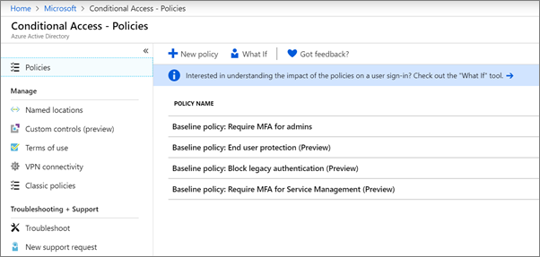

# Konfigurowanie zasad dostępu warunkowego

[Zasady dostępu warunkowego](https://docs.microsoft.com/azure/active-directory/conditional-access/overview) zwiększają dodatkowe zabezpieczenia. Firma Microsoft udostępnia zestaw bazowych zasad dostępu warunkowego, które są zalecane dla wszystkich klientów. Zasady bazowe to zestaw wstępnie zdefiniowanych zasad, które pomagają chronić organizacje przed wieloma typowymi atakami. Te typowe ataki mogą obejmować rozpylanie hasła, powtarzanie i wyłudzanie informacji.

Te zasady wymagają od administratorów i użytkowników wprowadzenia drugiej formy uwierzytelniania (nazywanej uwierzytelnianiem wieloskładnikowym lub uwierzytelniania wieloskładnikowego), gdy spełnione są określone warunki. Na przykład jeśli użytkownik loguje się z innego kraju, logowanie może być uznane za ryzykowne, a użytkownik musi podać dodatkową formę uwierzytelniania. 

Obecnie zasady linii bazowej są następujące:
- **Wymagaj usługi MFA dla administratorów** &ndash; Wymaga uwierzytelniania wieloskładnikowego dla najbardziej uprzywilejowanych ról administratora, w tym administratora globalnego.
- **Ochrona** &ndash; użytkowników końcowych Wymaga uwierzytelniania wieloskładnikowego dla użytkowników tylko wtedy, gdy logowanie jest ryzykowne. 
- **Blokowanie starszego uwierzytelniania** &ndash; Starsze aplikacje klienckie i niektóre nowe aplikacje nie używają nowszych, bezpieczniejszych protokołów uwierzytelniania. Te starsze aplikacje mogą pomijać zasady dostępu warunkowego i uzyskać nieautoryzowany dostęp do środowiska. Ta zasada blokuje dostęp z klientów, którzy nie obsługują dostępu warunkowego. 
- **Wymagaj usługi MFA do zarządzania usługami** &ndash; Wymaga uwierzytelniania wieloskładnikowego w celu uzyskania dostępu do narzędzi do zarządzania, w tym witryny Azure Portal (w której można skonfigurować zasady bazowe). 

Firma Microsoft zaleca włączenie wszystkich tych zasad bazowych. Po włączeniu tych zasad administratorzy i użytkownicy zostaną poproszeni o zarejestrowanie się w celu uwierzytelniania wieloskładnikowego platformy Azure.

Aby uzyskać więcej informacji na temat tych zasad, zobacz [Co to są zasady bazowe?](https://docs.microsoft.com/azure/active-directory/conditional-access/concept-baseline-protection)

## Konfigurowanie zasad planu bazowego

1. Przejdź do [witryny Azure Portal](https://portal.azure.com), a następnie przejdź do **usługi Azure Active Directory** \> **Conditional Access**.
    
    Zasady linii bazowej są wymienione na stronie.    
    
1. Zobacz następujące instrukcje dotyczące każdej zasady:

  - [Wymagaj usługi MFA dla administratorów](https://docs.microsoft.com/azure/active-directory/conditional-access/howto-baseline-protect-administrators)
- [Wymagaj usługi MFA dla użytkowników](https://docs.microsoft.com/azure/active-directory/conditional-access/howto-baseline-protect-end-users)  
 - [Blokowanie uwierzytelniania starszego](https://docs.microsoft.com/azure/active-directory/conditional-access/howto-baseline-protect-legacy-auth)
  - [Wymagaj usługi MFA do zarządzania usługami](https://docs.microsoft.com/azure/active-directory/conditional-access/howto-baseline-protect-azure)

Można skonfigurować wiele dodatkowych zasad, takich jak wymaganie zatwierdzonych aplikacji klienckich. Aby uzyskać więcej informacji, zobacz [dokumentację dostępu warunkowego](https://docs.microsoft.com/azure/active-directory/conditional-access/).
