# Konfigurowanie urządzeń przenośnych dla Microsoft 365 dla użytkowników biznesowychSet up mobile devices for Microsoft 365 for business users

Postępuj zgodnie z instrukcjami na kartach, aby zainstalować pakiet Office na telefonie iPhone lub telefonie z systemem Android.Follow the instructions in the tabs to install Office on an iPhone or an Android phone. Po zakończeniu tych czynności pliki służbowe utworzone w Office będą chronione przez usługę Microsoft 365 dla firm.After you follow these steps, your work files created in Office apps will be protected by Microsoft 365 for business.

Przykład dotyczy programu Outlook, ale procedura ma zastosowanie do wszystkich innych aplikacji pakietu Office, które także chcesz zainstalować.The example is for Outlook, but applies for any other Office apps you want to install also.
  
## Konfigurowanie urządzeń przenośnychSet up mobile devices

## [iPhoneiPhone](#tab/iPhone)
  
Obejrzyj krótki klip wideo, aby dowiedzieć się, jak skonfigurować aplikacje Office na urządzeniach z systemem iOS Microsoft 365 dla firm.Watch a short video on how to set up Office apps on iOS devices with Microsoft 365 for business.  

> [!VIDEO https://www.microsoft.com/videoplayer/embed/RWee2n] 

Jeśli ten klip wideo okazał się przydatny, poznaj [kompletną serię szkoleń dla małych firm i nowych użytkowników usługi Microsoft 365](../business-video/index.yml).If you found this video helpful, check out the [complete training series for small businesses and those new to Microsoft 365](../business-video/index.yml).

Przejdź do sklepu **App Store**, a następnie w polu wyszukiwania wpisz Microsoft Outlook.Go to **App store**, and in the search field type in Microsoft Outlook.
  
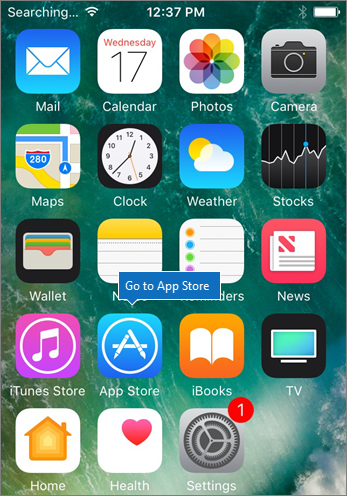
  
Naciśnij ikonę chmury, aby zainstalować program Outlook.Tap the cloud icon to install Outlook.
  
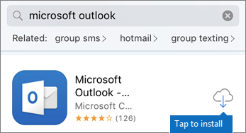
  
Po zakończeniu instalacji naciśnij przycisk **Otwórz**, aby otworzyć aplikację Outlook, a następnie naciśnij pozycję **Rozpocznij**.When the installation is done, tap the **Open** button to open Outlook and then tap **Get Started**.
  
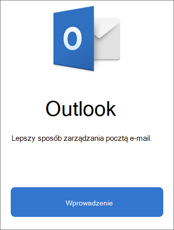
  
Wprowadź służbowy adres  e-mail na ekranie Dodawanie konta e-mail Dodaj konto, a następnie wprowadź poświadczenia usługi \> Microsoft 365 dla \> **firm.**Enter your work email address on the **Add Email Account** screen \> **Add Account**, and then enter your Microsoft 365 for business credentials \> **Sign in**.
  
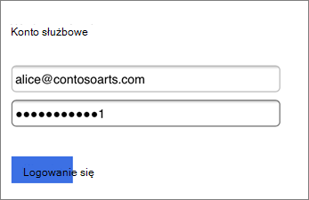
  
Jeśli Twoja organizacja chroni pliki w aplikacjach, zostanie wyświetlone okno dialogowe z informacją, że twoja organizacja chroni teraz dane w aplikacji i musisz ponownie uruchomić aplikację, aby nadal jej używać.If your organization is protecting files in apps, you'll see a dialog stating that your organization is now protecting the data in the app and you need to restart the app to continue to use it. Naciśnij przycisk **OK** i zamknij aplikację Outlook.Tap **OK** and close Outlook. 
  
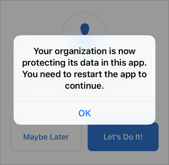
  
Znajdź aplikację Outlook na telefonie iPhone i uruchom ją ponownie.Locate Outlook on the iPhone, and restart it. Po wyświetleniu monitu wprowadź numer PIN i zweryfikuj go.When prompted, enter a PIN and verify it. Aplikacja Outlook w telefonie iPhone jest teraz gotowa do użycia.Outlook on your iPhone is now ready to be used.
  
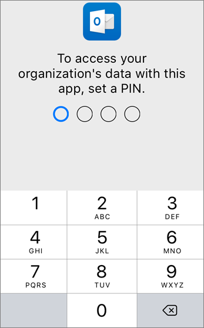
  
## [AndroidAndroid](#tab/Android)
  
Obejrzyj klip wideo o instalowaniu aplikacji Outlook i Office urządzeniach z systemem Android.Watch a video about installing Outlook and Office on Android devices.  

> [!VIDEO https://www.microsoft.com/videoplayer/embed/ecc2e9c0-bc7e-4f26-8b14-91d84dbcfef0] 

Jeśli ten klip wideo okazał się przydatny, poznaj [kompletną serię szkoleń dla małych firm i nowych użytkowników usługi Microsoft 365](../business-video/index.yml).If you found this video helpful, check out the [complete training series for small businesses and those new to Microsoft 365](../business-video/index.yml).

Aby rozpocząć konfigurację na telefonie z systemem Android, przejdź do sklepu Play.To begin setup on your Android phone, go to the Play Store.
  
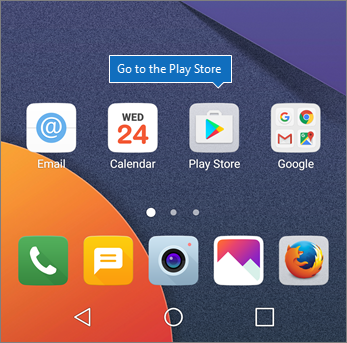
  
Wprowadź microsoft Outlook w polu wyszukiwania Sklepu Google Play i naciśnij pozycję **Zainstaluj**.Enter Microsoft Outlook in the Google Play search box and tap **Install**. Po Outlook zakończeniu instalacji naciśnij pozycję **Otwórz**.Once Outlook is done installing, tap **Open**.
  
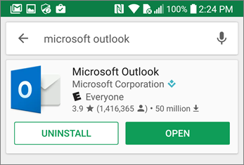
  
W aplikacji Outlook naciśnij pozycję **Wprowadzenie**, a następnie dodaj konto e-mail Microsoft 365 dla firm Kontynuuj i zaloguj się przy użyciu \> poświadczeń organizacji.In the Outlook app, tap **Get Started**, then add your Microsoft 365 for business email account \> **Continue**, and sign in with your organization credentials.
  
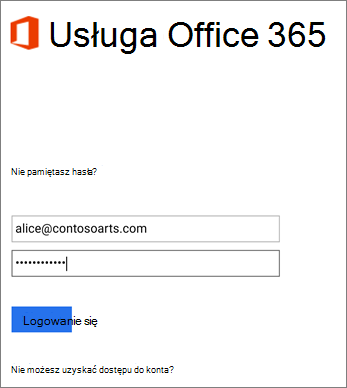
  
W oknie dialogowym z informacją o konieczności zainstalowania aplikacji portalu firmy Intune naciśnij pozycję **Przejdź do sklepu**.In the dialog that states you must install the Intune Company Portal app, tap **Go to store**.
  
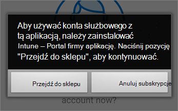
  
W Sklepie Play zainstaluj aplikację Intune — Portal firmy.In Play Store, install Intune Company Portal.
  
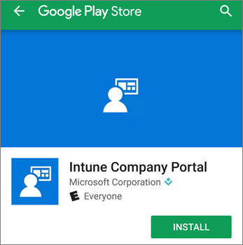
  
Otwórz ponownie aplikację Outlook, a następnie wprowadź i potwierdź numer PIN. Aplikacja Outlook jest teraz gotowa do użycia.Open Outlook again, and enter and confirm a PIN. Your Outlook app is now ready for use.
  
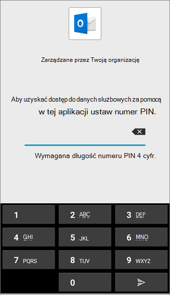

## Zawartość pokrewnaRelated content

[Microsoft 365 szkoleniowe klipy wideo dla firmMicrosoft 365 for business training videos](../business-video/index.yml)

---
