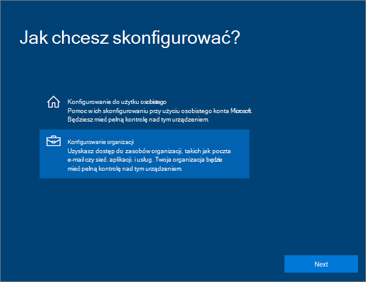
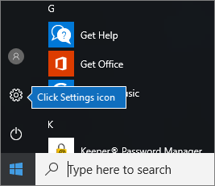
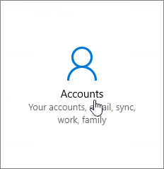
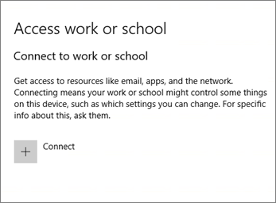
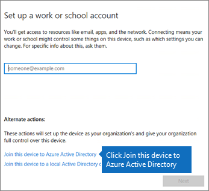
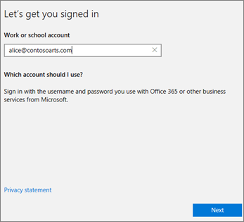
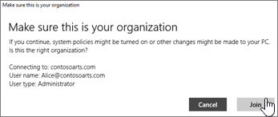
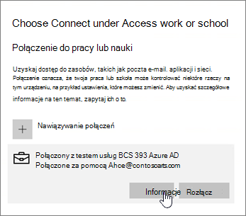
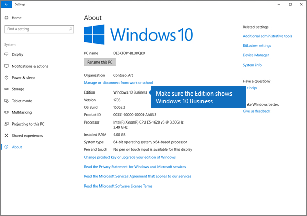

# Konfigurowanie urządzeń z systemem Windows dla użytkowników usługi Microsoft 365 BusinessSet up Windows devices for Microsoft 365 Business users

## Wymagania wstępne dotyczące konfigurowania urządzeń z systemem Windows dla użytkowników usługi Microsoft 365 BusinessPrerequisites for setting up Windows devices for Microsoft 365 Business users

Zanim będzie można skonfigurować urządzenia z systemem Windows dla użytkowników usługi Microsoft 365 Business należy się upewnić, że na wszystkich tych urządzeniach jest zainstalowany system Windows 10 Pro w wersji 1703 (aktualizacja dla twórców). System Windows 10 Pro stanowi wymaganie wstępne w przypadku wdrażania systemu Windows 10 Business — zestawu usług w chmurze i funkcji zarządzania urządzeniami — który uzupełnia system Windows 10 Pro i udostępnia mechanizmy scentralizowanego zarządzania i zabezpieczeń usługi Microsoft 365 Business.Before you can set up Windows devices for Microsoft 365 Business users, make sure all the Windows devices are running Windows 10 Pro, version 1703 (Creators Update). Windows 10 Pro is a prerequisite for deploying Windows 10 Business, which is a set of cloud services and device management capabilities that complement Windows 10 Pro and enable the centralized management and security controls of Microsoft 365 Business.
  
Jeśli na urządzeniach z systemem Windows działa system Windows 7 Pro, Windows 8 Pro lub Windows 8.1 Pro, to subskrypcja usługi Microsoft 365 Business uprawnia do uaktualnienia do systemu Windows 10.If you have Windows devices running Windows 7 Pro, Windows 8 Pro, or Windows 8.1 Pro, your Microsoft 365 Business subscription entitles you to a Windows 10 upgrade.
  
Aby uzyskać więcej informacji na temat uaktualniania urządzeń z systemem Windows do systemu Windows 10 Pro (aktualizacja dla twórców), wykonaj czynności opisane w tym temacie: [Uaktualnianie urządzeń z systemem Windows do systemu Windows Pro (aktualizacja dla twórców)](upgrade-to-windows-pro-creators-update.md).For more information on how to upgrade Windows devices to Windows 10 Pro Creators Update, follow the steps in this topic: [Upgrade Windows devices to Windows Pro Creators Update](upgrade-to-windows-pro-creators-update.md).
  
Zobacz [Weryfikowanie, czy urządzenie jest połączone z usługą Azure AD,](#verify-the-device-is-connected-to-azure-ad) aby sprawdzić, czy uaktualnienie ma być uaktualnione, lub aby upewnić się, że uaktualnienie działało.See [Verify the device is connected to Azure AD](#verify-the-device-is-connected-to-azure-ad) to verify you have the upgrade, or to make sure the upgrade worked.

Obejrzyj krótki klip wideo przedstawiający połączenie systemu Windows z usługą Microsoft 365.Watch a short video about connecting Windows to Microsoft 365.  

> [!VIDEO https://www.microsoft.com/videoplayer/embed/RE3yXh3] 

Jeśli ten klip wideo okazał się przydatny, poznaj [kompletną serię szkoleń dla małych firm i nowych użytkowników platformy Microsoft 365](https://support.office.com/article/6ab4bbcd-79cf-4000-a0bd-d42ce4d12816).If you found this video helpful, check out the [complete training series for small businesses and those new to Microsoft 365](https://support.office.com/article/6ab4bbcd-79cf-4000-a0bd-d42ce4d12816).
  
## Dołączanie urządzeń z systemem Windows 10 do usługi Azure AD organizacjiJoin Windows 10 devices to your organization's Azure AD

Jeśli wszystkie urządzenia z systemem Windows w organizacji zostały uaktualnione do usługi Windows 10 Pro Creators Update lub są już uruchomione w usłudze Windows 10 Pro Creators Update, możesz dołączyć te urządzenia do usługi Azure Active Directory w organizacji.When all Windows devices in your organization have either been upgraded to Windows 10 Pro Creators Update or are already running Windows 10 Pro Creators Update, you can join these devices to your organization's Azure Active Directory. Po dołączeniu urządzeń zostaną one automatycznie uaktualnione do systemu Windows 10 Business, który jest częścią subskrypcji usługi Microsoft 365 Business.Once the devices are joined, they'll be automatically upgraded to Windows 10 Business, which is part of your Microsoft 365 Business subscription.
  
### Całkowicie nowe lub nowo uaktualnione urządzenie z systemem Windows 10 ProFor a brand new, or newly upgraded, Windows 10 Pro device

W przypadku całkowicie nowego urządzenia z systemem Windows 10 Pro (aktualizacja dla twórców) lub w przypadku urządzenia, które zostało uaktualnione do systemu Windows 10 Pro (aktualizacja dla twórców), ale nie przeszło konfiguracji urządzenia z systemem Windows 10, wykonaj poniższe czynności.For a brand new device running Windows 10 Pro Creators Update, or for a device that was upgraded to Windows 10 Pro Creators Update but has not gone through Windows 10 device setup, follow these steps.
  
1. Postępuj zgodnie z instrukcjami konfiguracji urządzenia z systemem Windows 10 do momentu przejścia do strony **Jak chcesz skonfigurować?**.Go through Windows 10 device setup until you get to the **How would you like to set up?** page. 
    
    
  
2. Na tej stronie wybierz opcję **Konfiguruj dla organizacji**, a następnie wprowadź nazwę użytkownika i hasło dla usługi Microsoft 365 Business.Here, choose **Set up for an organization** and then enter your username and password for Microsoft 365 Business. 
    
3. Dokończ konfigurację urządzenia z systemem Windows 10.Finish Windows 10 device setup.
    
   Gdy to zrobisz, użytkownik będzie połączony z usługą Azure AD organizacji. Zobacz [Sprawdzanie, czy urządzenie zostało połączone z usługą Azure AD](#verify-the-device-is-connected-to-azure-ad), aby się upewnić.Once you're done, the user will be connected to your organization's Azure AD. See [Verify the device is connected to Azure AD](#verify-the-device-is-connected-to-azure-ad) to make sure. 
  
### Urządzenie już skonfigurowane z uruchomionym systemem Windows 10 ProFor a device already set up and running Windows 10 Pro

 **Połącz użytkowników z usługą Azure AD:****Connect users to Azure AD:**
  
1. Na komputerze PC użytkownika z systemem Windows 10 Pro w wersji 1703 z aktualizacją dla twórców (zobacz [wymagania wstępne](pre-requisites-for-data-protection.md)) kliknij logo systemu Windows i wybierz ikonę Ustawienia.In your user's Windows PC, that is running Windows 10 Pro, version 1703 (Creators Update) (see [pre-requisites](pre-requisites-for-data-protection.md)), click the Windows logo, and then the Settings icon.
  
   
  
2. W oknie **Ustawienia** wybierz opcję **Konta**.In **Settings**, go to **Accounts**.
  
   
  
3. Na stronie **Twoje informacje** kliknij pozycję **Uzyskaj dostęp do miejsca pracy lub nauki** \> **Połącz**.On **Your info** page, click **Access work or school** \> **Connect**.
  
   
  
4. W oknie dialogowym **Konfigurowanie konta służbowego** w sekcji **Alternatywne działania** wybierz pozycję **Dołącz to urządzenie do usługi Azure Active Directory**.On the **Set up a work or school account** dialog, under **Alternate actions**, choose **Join this device to Azure Active Directory**.
  
   
  
5. On the **Let's get you signed in** page, enter your work or school account \> **Next**.On the **Let's get you signed in** page, enter your work or school account \> **Next**.
  
   On the **Enter password** page, enter your password \> **Sign in**.On the **Enter password** page, enter your password \> **Sign in**.
  
   
  
6. Upewnij **się, że jest to strona organizacji,** sprawdź, czy informacje są poprawne, a następnie kliknij przycisk **Dołącz**.On the **Make sure this is your organization** page, verify that the information is correct, and click **Join**.
  
   Na stronie **Wszystko gotowe** kliknij przycisk **Gotowe**.On the **You're all set!** page, click **Done**.
  
   
  
Jeśli masz pliki przesłane do usługi OneDrive dla Firm, zsynchronizuj je z powrotem.If you uploaded files to OneDrive for Business, sync them back down. Jeśli do migracji profilu i plików użyto narzędzia innej firmy, należy również zsynchronizować je z nowym profilem.If you used a third-party tool to migrate profile and files, also sync those to the new profile.
  
## Sprawdzanie, czy urządzenie zostało połączone z usługą Azure ADVerify the device is connected to Azure AD

Aby sprawdzić stan synchronizacji, na stronie **Uzyskaj dostęp do miejsca pracy lub nauki** w sekcji **Ustawienia** kliknij obszar **Połączono z** _ \<organization name\> _ w celu pokazania przycisków **Informacje** i **Rozłącz**. Kliknij przycisk **Informacje**, aby wyświetlić stan synchronizacji.To verify your sync status, on the **Access work or school** page in **Settings**, click in the **Connected to** _ \<organization name\> _ area to expose the buttons **Info** and **Disconnect**. Click on **Info** to get your synchronization status. 
  
Na stronie Stan synchronizacji kliknij pozycję Synchronizuj, aby pobrać na komputer PC najnowsze zasady zarządzania urządzeniami przenośnymi.On the Sync status page, click Sync to get the latest mobile device management policies onto the PC.
  
Aby rozpocząć korzystanie z konta Microsoft 365 Business, przejdź do przycisku **Start** systemu Windows, kliknij prawym przyciskiem myszy bieżący obraz konta, a następnie **przełącz konto**.To start using the Microsoft 365 Business account, go to the Windows **Start** button, right-click your current account picture, and then **Switch account**. Zaloguj się przy użyciu adresu e-mail i hasła organizacji.Sign in by using your organization email and password.
  

  
## Sprawdzanie, czy urządzenie zostało uaktualnione do systemu Windows 10 BusinessVerify the device is upgraded to Windows 10 Business

Sprawdź, czy urządzenia z systemem Windows 10 dołączone do usługi Azure AD zostały uaktualnione do systemu Windows 10 Business w ramach subskrypcji usługi Microsoft 365 Business.Verify that your Azure AD joined Windows 10 devices were upgraded to Windows 10 Business as part of your Microsoft 365 Business subscription.
  
1. Wybierz pozycję **Ustawienia** \> **System** \> **Informacje**.Go to **Settings** \> **System** \> **About**.
    
2. Potwierdź, że w polu **Wersja** jest wskazywany system **Windows 10 Business**.Confirm that the **Edition** shows **Windows 10 Business**.
    
    
  
## Następne czynnościNext steps

Aby skonfigurować urządzenia przenośne, zobacz [Konfigurowanie urządzeń przenośnych dla użytkowników usługi Microsoft 365 Business](set-up-mobile-devices.md). Aby ustawić zasady ochrony aplikacji lub ochrony urządzeń, zobacz [Zarządzanie usługą Microsoft 365 Business](manage.md).To set up your mobile devices, see [Set up mobile devices for Microsoft 365 Business users](set-up-mobile-devices.md), To set device protection or app protection policies, see [Manage Microsoft 365 Business](manage.md).
  
## Więcej informacji na temat konfigurowania i korzystania z usługi Microsoft 365 BusinessFor more on setting up and using Microsoft 365 Business

[Szkoleniowe klipy wideo dotyczące rozwiązania Microsoft 365 BusinessMicrosoft 365 Business training videos](https://support.office.com/article/6ab4bbcd-79cf-4000-a0bd-d42ce4d12816)
