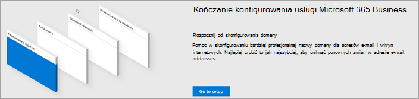
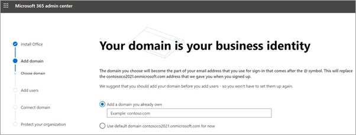
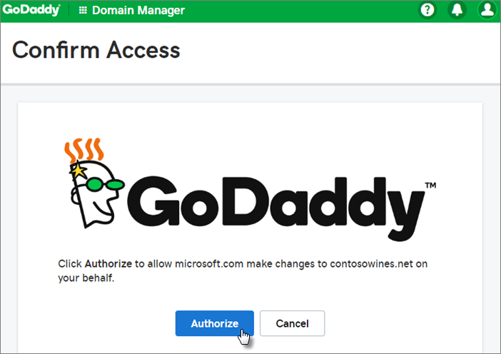
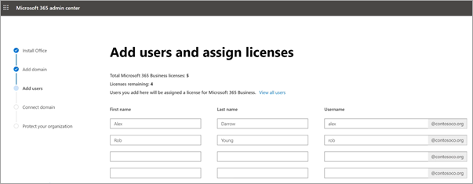
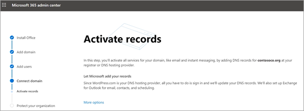
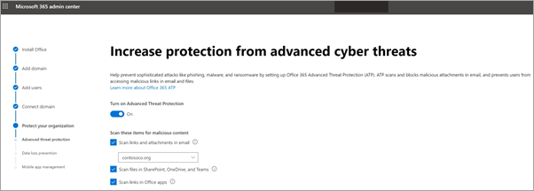
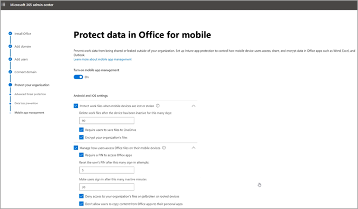

# Konfigurowanie Microsoft 365 Business Premium kreatora konfiguracjiSet up Microsoft 365 Business Premium in the setup wizard

Obejrzyj ten klip wideo, aby uzyskać omówienie Microsoft 365 Business Premium konfiguracji.Watch this video for an overview of Microsoft 365 Business Premium setup.  

> [!VIDEO https://www.microsoft.com/videoplayer/embed/RE4jZwg] 

## Dodawanie domeny, użytkowników i konfigurowanie zasadAdd your domain, users, and set up policies

Podczas zakupu Microsoft 365 Business Premium masz możliwość używania domeny, która należy do Ciebie, lub kupowania jej podczas [rejestracji](sign-up.md).When you purchase Microsoft 365 Business Premium, you have the option of using a domain you own, or buying one during the [sign-up](sign-up.md).

- Jeśli podczas rejestracji w domenie kupiono nową domenę, to jest ona w ogóle ustawiona. Możesz przejść do dodawania użytkowników [i przypisywania licencji.](#add-users-and-assign-licenses)If you purchased a new domain when you signed up, your domain is all set up and you can move to [Add users and assign licenses](#add-users-and-assign-licenses).

### Dodawanie domeny w celu spersonalizowania logowaniaAdd your domain to personalize sign-in

1. Zaloguj się do [Microsoft 365 administracyjnego](https://admin.microsoft.com) przy użyciu poświadczeń administratora globalnego.Sign in to [Microsoft 365 admin center](https://admin.microsoft.com) by using your global admin credentials. 

2. Wybierz **pozycję Przejdź do konfiguracji,** aby uruchomić kreatora.Choose **Go to setup** to start the wizard.

    

3. Na **stronie Instalowanie Office aplikacji** możesz opcjonalnie zainstalować te aplikacje na swoim komputerze.On the **Install your Office apps** page, you can optionally install the apps on your own computer.
    
4. W kroku **Dodaj domenę** wprowadź nazwę domeny, której chcesz użyć (na przykład contoso.com).In the **Add domain** step, enter the domain name you want to use (like contoso.com).

    > [!IMPORTANT]
    > Jeśli podczas rejestracji zakupiono domenę, nie zobaczysz tutaj kroku **Dodaj** domenę.If you purchased a domain during the sign-up, you will not see **Add a domain** step here. Zamiast tego [przejdź do przycisku Dodaj](#add-users-and-assign-licenses) użytkowników.Go to [Add users](#add-users-and-assign-licenses) instead.

    

    
4. Postępuj zgodnie z instrukcjami kreatora, aby utworzyć rekordy DNS u dowolnego dostawcy [hostingu DNS](/office365/admin/get-help-with-domains/create-dns-records-at-any-dns-hosting-provider) dla Microsoft 365 weryfikację prawa do domeny.Follow the steps in the wizard to [Create DNS records at any DNS hosting provider for Microsoft 365](/office365/admin/get-help-with-domains/create-dns-records-at-any-dns-hosting-provider) that verifies you own the domain. Jeśli znasz hosta domeny, zobacz też szczegółowe [instrukcje dla danego hosta.](/office365/admin/get-help-with-domains/set-up-your-domain-host-specific-instructions)If you know your domain host, see also the [host specific instructions](/office365/admin/get-help-with-domains/set-up-your-domain-host-specific-instructions).

    Jeśli Twój dostawca hostingu to Firma GoDaddy lub inny host z włączonym nawiązywaniem połączenia z domeną, ten proces jest łatwy i zostanie automatycznie poproszony o zalogowanie się i uwierzytelnienie przez firmę Microsoft w Twoim imieniu.If your hosting provider is GoDaddy or another host enabled with [domain connect](/office365/admin/get-help-with-domains/domain-connect), the process is easy and you'll be automatically asked to sign in and let Microsoft authenticate on your behalf.

    

### Dodawanie użytkowników i przypisywanie licencjiAdd users and assign licenses

Użytkowników można dodać w kreatorze, ale można też [dodać](../admin/add-users/add-users.md) ich później w centrum administracyjnym.You can add users in the wizard, but you can also [add users later](../admin/add-users/add-users.md) in the admin center. Ponadto, jeśli masz lokalny kontroler domeny, możesz dodawać użytkowników z [usługą Azure AD Połączenie.](/azure/active-directory/hybrid/how-to-connect-install-express)Additionally, if you have a local domain controller, you can add users with [Azure AD Connect](/azure/active-directory/hybrid/how-to-connect-install-express).

#### Dodawanie użytkowników w kreatorzeAdd users in the wizard

Użytkownicy, których dodasz w kreatorze, zostaną automatycznie przypisani do Microsoft 365 Business Premium licencji.Any users you add in the wizard get automatically assigned a Microsoft 365 Business Premium license.

1. Jeśli Twoja Microsoft 365 Business Premium ma już użytkowników (na przykład jeśli używasz usługi Azure AD Połączenie), możesz teraz przypisać im licencje.If your Microsoft 365 Business Premium subscription has existing users (for example, if you used Azure AD Connect), you get an option to assign licenses to them now. Możesz dodać licencje dla tych użytkowników.Go ahead and add licenses to them as well.

2. Po dodaniu użytkowników zostanie również dodana opcja udostępnienia poświadczeń nowym użytkownikom.After you've added the users, you'll also get an option to share credentials with the new users you added. Możesz wydrukować te informacje, wysłać je pocztą e-mail lub pobrać.You can choose to print them out, email them, or download them.

### Łączenie domenyConnect your domain

> [!NOTE]
> Jeśli do skonfigurowania użytkowników wybrano domenę .onmicrosoft lub do skonfigurowania użytkowników była używana usługa Azure AD Połączenie, ten krok nie zostanie wyświetlony.If you chose to use the .onmicrosoft domain, or used Azure AD Connect to set up users, you will not see this step.
  
Aby skonfigurować usługi, musisz zaktualizować niektóre rekordy na swoim hoście DNS lub u rejestratora domen.To set up services, you have to update some records at your DNS host or domain registrar.
  
1. Kreator konfiguracji zwykle wykrywa rejestratora i udostępnia linki do instrukcji krok po kroku dotyczących aktualizowania rekordów serwera nazw w witrynie internetowej rejestratora.The setup wizard typically detects your registrar and gives you a link to step-by-step instructions for updating your NS records at the registrar website. Jeśli tak się nie stanie, zmień serwery nazw, aby Microsoft 365 [u dowolnego rejestratora domen.](../admin/get-help-with-domains/change-nameservers-at-any-domain-registrar.md)If it doesn't, [Change nameservers to set up Microsoft 365 with any domain registrar](../admin/get-help-with-domains/change-nameservers-at-any-domain-registrar.md). 

    - Jeśli masz istniejące rekordy DNS, na przykład istniejącą witrynę internetową, ale dla Twojego hosta DNS włączono łączenie [domen,](/office365/admin/get-help-with-domains/domain-connect)wybierz pozycję **Dodaj rekordy.**If you have existing DNS records, for example an existing web site, but your DNS host is enabled for [domain connect](/office365/admin/get-help-with-domains/domain-connect), choose **Add records for me**. Na stronie **Wybierz usługi online** zaakceptuj wszystkie ustawienia domyślne, wybierz pozycję **Dalej,** a następnie wybierz pozycję **Autoryzuj** na stronie swojego hosta DNS.On the **Choose your online services** page, accept all the defaults, and choose **Next**, and choose **Authorize** on your DNS host's page.
    - Jeśli masz istniejące rekordy DNS z innymi hostami DNS (bez włączonego łączenia domen), musisz zarządzać swoimi rekordami DNS, aby upewnić się, że istniejące usługi pozostają połączone.If you have existing DNS records with other DNS hosts (not enabled for domain connect), you'll want to manage your own DNS records to make sure the existing services stay connected. Aby [uzyskać więcej informacji, zobacz](/office365/admin/get-help-with-domains/dns-basics) Podstawowe informacje o domenie.See [domain basics](/office365/admin/get-help-with-domains/dns-basics) for more info.

        

2. Postępuj zgodnie z instrukcjami kreatora, aby skonfigurować pocztę e-mail i inne usługi.Follow the steps in the wizard and email and other services will be set up for you.

### Ochrona organizacjiProtect your organization 

Zasady ustawione w kreatorze są automatycznie stosowane do [grupy](/office365/admin/create-groups/compare-groups#security-groups) zabezpieczeń o nazwie *Wszyscy użytkownicy.*The policies you set up in the wizard are applied automatically to a [Security group](/office365/admin/create-groups/compare-groups#security-groups) called *All Users*. Możesz również utworzyć dodatkowe grupy, do których będą przypisywane zasady w centrum administracyjnym.You can also create additional groups to assign policies to in the admin center.

1. Na stronie Zwiększanie ochrony przed **zaawansowanymi zagrożeniami** cyberzagrożeniami zalecane jest zaakceptowanie ustawień domyślnych w celu Office 365 zaawansowanej ochrony przed zagrożeniami w plikach i linkach w Office aplikacjach. On the **Increase protection from advanced cyber threats**, it is recommended that you accept the defaults to let [Office 365 Advance Threat Protection](../security/office-365-security/defender-for-office-365.md) scan files and links in Office apps.

    

2. Na stronie **Zapobiegaj wyciekom poufnych** danych zaakceptuj wartości domyślne Office 365, aby włączyć zapobieganie utracie danych (DLP, Data Loss Prevention) w celu śledzenia poufnych danych w aplikacjach Office i zapobiegania przypadkowemu udostępnianiu tych danych poza Twoją organizacją.On the **Prevent leaks of sensitive data** page, accept the defaults to turn on Office 365 Data Loss Prevention (DLP) to track sensitive data in Office apps and prevent the accidental sharing of these outside your organization.

3. Na stronie **Ochrona danych w aplikacji Office** dla urządzeń przenośnych pozostaw opcję zarządzanie aplikacją mobilną wł., rozwiń ustawienia i przejrzyj je, a następnie wybierz pozycję Utwórz zasady zarządzania aplikacją **mobilną.**On the **Protect data in Office for mobile** page, leave mobile app management on, expand the settings and review them, and then select **Create mobile app management policy**.

    

## Zabezpieczanie Windows 10 komputerachSecure Windows 10 PCs

W okienku po lewej stronie wybierz pozycję **Konfiguracja,** a następnie w obszarze Logowanie się i zabezpieczenia wybierz pozycję Zabezpiecz swoje **Windows 10 komputerach**.On the left nav, select **Setup** and then, under **Sign-in and security**, choose **Secure your Windows 10 computers**. Wybierz **pozycję Widok,** aby rozpocząć.Choose **View** to get started. Zobacz [Zabezpieczanie komputera Windows 10, aby](secure-win-10-pcs.md) uzyskać pełne instrukcje.See [secure your Windows 10 computers](secure-win-10-pcs.md) for complete instructions.

## Wdrażanie Office 365 klienckichDeploy Office 365 client apps

Jeśli podczas instalacji wybierzesz automatyczne instalowanie aplikacji Office, zostaną one zainstalowane na urządzeniach z systemem Windows 10 po zalogowaniu się użytkowników do usługi Azure AD na ich urządzeniach z systemem Windows przy użyciu poświadczeń służbowych.If you chose to automatically install Office apps during setup, the apps will install on the Windows 10 devices once the users have signed in to Azure AD from their Windows devices, using their work credentials.

Aby zainstalować Office urządzeniach przenośnych z systemem iOS lub Android, zobacz Konfigurowanie urządzeń przenośnych [Microsoft 365 Business Premium użytkowników.](set-up-mobile-devices.md)To install Office on mobile iOS or Android devices, see [Set up mobile devices for Microsoft 365 Business Premium users](set-up-mobile-devices.md).

Możesz również zainstalować pakiet Office instalacji pojedynczo.You can also install Office individually. Aby [uzyskać instrukcje,](https://support.microsoft.com/office/4414eaaf-0478-48be-9c42-23adc4716658) Office zainstalować pakiet na komputerze PC lub Mac.See [install Office on a PC or Mac](https://support.microsoft.com/office/4414eaaf-0478-48be-9c42-23adc4716658) for instructions.

## Zobacz teżSee also

[Microsoft 365 szkoleniowe klipy wideo dla firmMicrosoft 365 for business training videos](../business-video/index.yml)
