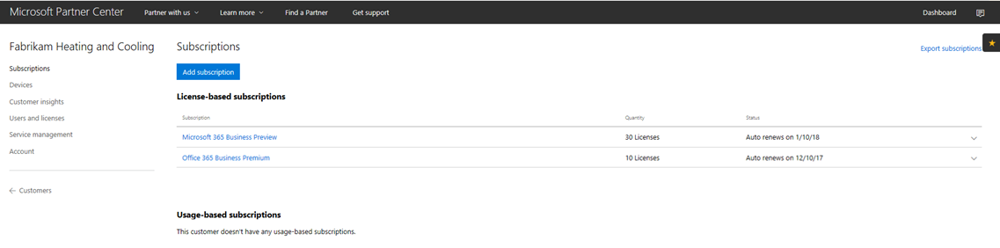
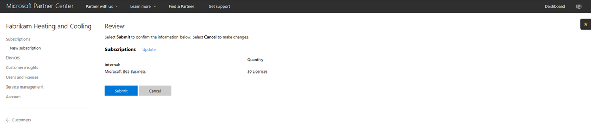
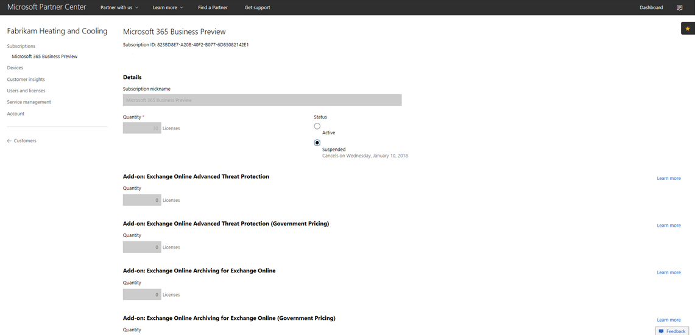
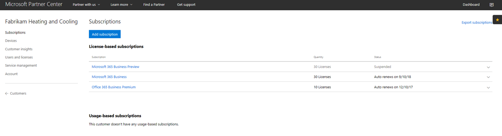
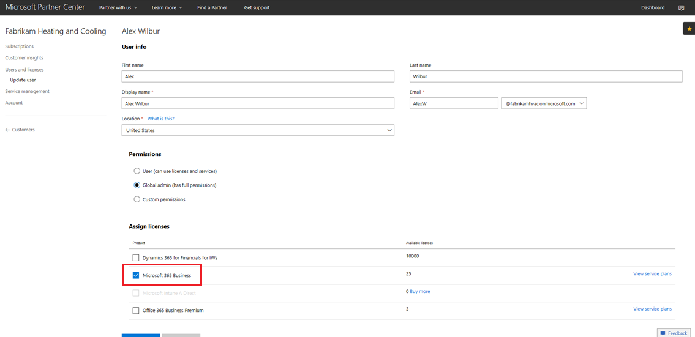

# Przechodzenie subskrypcji usługi Microsoft 365 CSP dla firm

Jeśli masz subskrypcję usługi CSP w wersji Microsoft 365 Business Preview, skorzystaj z tego przewodnika, aby dowiedzieć się, jak można zmienić istniejącą subskrypcję wersji Preview na Microsoft 365 Business GA (ogólna dostępność).

**Jak przejść z subskrypcji w wersji Preview na subskrypcję ga**

1. Zaloguj się do <a href="https://partnercenter.microsoft.com" target="_blank">Centrum partnerskiego.</a>
2. Na pulpicie nawigacyjnym wybierz **pozycję Klienci**, a następnie znajdź i wybierz nazwę firmy.

    Zostaną wyświetlone subskrypcje tej firmy.

    
    
3. Na stronie Subskrypcje **firmy** wybierz pozycję **Dodaj subskrypcję**.
4. Na stronie **Nowa subskrypcja** wybierz pozycję **Mała** firma, a następnie Microsoft 365 **z** listy.
5. Dodaj liczbę licencji, a następnie wybierz pozycję **Dalej: Recenzja,** aby przejrzeć subskrypcję, a następnie wybierz pozycję **Prześlij**.

    

    Subskrypcje **oparte na licencjach będą** Microsoft 365 Business Preview i **Microsoft 365** **Business.** Następnie zawiesisz subskrypcję w wersji Preview.

6. Wybierz **Microsoft 365 Business Preview.**
7. Na stronie **Microsoft 365 Business Preview** wybierz pozycję Zawieszone, aby zawiesić subskrypcję wersji Preview. 

    

8. Wybierz **pozycję Prześlij,** aby potwierdzić.

    Na stronie **Subskrypcje** potwierdź, że w oknie Microsoft 365 **Business Preview** jest **wyświetlony** stan Zawieszone.

    

9. Opcjonalnie możesz także sprawdzić poprawność umowy licencyjnej. Aby to zrobić, wykonaj następujące kroki.
    1. Na **stronie Subskrypcje** firmy wybierz pozycję Użytkownicy **i licencje.**
    2. Na **stronie Użytkownicy i licencje** wybierz użytkownika.
    3. Na stronie użytkownika sprawdź sekcję **Przypisywanie** licencji i upewnij się, że jest na nim pokaz Microsoft 365 **Business.**

        

## Wpływ na klientów i użytkowników w trakcie przejścia i po jego zakończeniu

Nie ma żadnego wpływu na klientów ani użytkowników podczas przechodzenia między klientami i użytkownikami po przejściach.

## Wpływ na klientów, którzy nie przejść

W poniższej tabeli podsumowano skutki dla klientów, którzy nie przeszli z subskrypcji usługi Microsoft 365 Business Preview do subskrypcji usługi Microsoft 365 Business.

|       | T-0 do T+30     | T+30 do T+60 | T+60 do T+120 | Poza T+120  |
|-------|-----------------|--------------|---------------|---------------|
| **Stan** | W okresie prolongaty | Wygasła      | Wyłączone      | Deprovisioned |
| **Skutki usługi**                                                        |
| **centrum administracyjne platformy Microsoft 365** | Brak wpływu na funkcjonalność | Brak wpływu na funkcjonalność | Można dodawać/usuwać użytkowników, kupować subskrypcje.  Nie można przypisać/odwołać licencji. | Subskrypcja klienta i wszystkie dane zostaną usunięte. Administrator może zarządzać innymi płatnymi subskrypcjami. |
| **Office aplikacji**                         | Brak wpływu na użytkownika końcowego | Brak wpływu na użytkownika końcowego | Office tryb ograniczonej funkcjonalności.  Użytkownicy mogą tylko wyświetlać pliki. | Office tryb ograniczonej funkcjonalności.  Użytkownicy mogą tylko wyświetlać pliki. |
| **Usługi w chmurze (SharePoint Online, Exchange Online, Skype, Teams i nie tylko)** | Brak wpływu na użytkownika końcowego | Brak wpływu na użytkownika końcowego | Użytkownicy końcowi i administratorzy nie mają dostępu do danych w chmurze. | Subskrypcja klienta i wszystkie dane zostaną usunięte. |
| **Składniki EM+S** | Brak wpływu na administratora  Brak wpływu na użytkownika końcowego | Brak wpływu na administratora  Brak wpływu na użytkownika końcowego | Funkcja nie jest już wymuszana.  Aby [uzyskać więcej informacji, zobacz Wygasanie](#mobile-device-impacts-upon-subscription-expiration) subskrypcji Windows 10 [urządzeń](#windows-10-pc-impacts-upon-subscription-expiration) przenośnych po wygaśnięciu subskrypcji. | Funkcja nie jest już wymuszana.  Aby [uzyskać więcej informacji, zobacz Wygasanie](#mobile-device-impacts-upon-subscription-expiration) subskrypcji Windows 10 [urządzeń](#windows-10-pc-impacts-upon-subscription-expiration) przenośnych po wygaśnięciu subskrypcji. |
| **Windows 10 Business** | Brak wpływu na administratora  Brak wpływu na użytkownika końcowego | Brak wpływu na administratora  Brak wpływu na użytkownika końcowego | Funkcja nie jest już wymuszana.  Aby [uzyskać więcej informacji, zobacz Wygasanie](#mobile-device-impacts-upon-subscription-expiration) subskrypcji Windows 10 [urządzeń](#windows-10-pc-impacts-upon-subscription-expiration) przenośnych po wygaśnięciu subskrypcji. | Funkcja nie jest już wymuszana.  Aby [uzyskać więcej informacji, zobacz Wygasanie](#mobile-device-impacts-upon-subscription-expiration) subskrypcji Windows 10 [urządzeń](#windows-10-pc-impacts-upon-subscription-expiration) przenośnych po wygaśnięciu subskrypcji. |
| **Logowanie usługi Azure AD na komputerze Windows 10 PC** | Brak wpływu na administratora  Brak wpływu na użytkownika końcowego | Brak wpływu na administratora  Brak wpływu na użytkownika końcowego | Brak wpływu na administratora  Brak wpływu na użytkownika końcowego | Po usunięciu dzierżawy użytkownik może zalogować się tylko przy użyciu poświadczeń lokalnych. Jeśli nie ma poświadczeń lokalnych, ponownie obrazuj urządzenie. |

## Urządzenia przenośne mają wpływ po wygaśnięciu subskrypcji

W poniższej tabeli podsumowano wpływ zasad zarządzania aplikacją na urządzenia przenośne.

|                            | Środowisko w pełni licencjonowane                      | T+60 dni po wygaśnięciu          |
|----------------------------|------------------------------------------------|------------------------------------|
| **Usuwanie plików służbowych z nieaktywnego urządzenia** | Pliki służbowe są usuwane po upływie wybranych dni | Pliki służbowe pozostają na urządzeniach osobistych użytkownika |
| **Wymuszaj na użytkownikach zapisywanie wszystkich plików służbowych w usłudze OneDrive dla Firm** | Pliki służbowe można zapisywać tylko w OneDrive dla Firm | Pliki służbowe można zapisywać w dowolnym miejscu |
| **Szyfruj pliki służbowe** | Pliki służbowe są szyfrowane | Pliki służbowe nie są już szyfrowane.  Zasady zabezpieczeń są usuwane, Office usuwane są dane aplikacji. |
| **Wymaganie numeru PIN lub odcisku palca w celu uzyskania Office aplikacji** | Ograniczony dostęp do aplikacji | Brak ograniczeń dostępu na poziomie aplikacji |
| **Resetuj numer PIN, gdy logowanie kończy się niepowodzeniem** | Ograniczony dostęp do aplikacji | Brak ograniczeń dostępu na poziomie aplikacji |
| **Wymagaj ponownego logowania użytkowników po Office bezczynności aplikacji** | Wymagane logowanie | Logowanie nie jest wymagane |
| **Odmów dostępu do plików służbowych na urządzeniach z usuniętymi natywnymi ograniczeniami producenta** | Na urządzeniach z jailbroken/rooted nie można uzyskiwać dostępu do plików służbowych | Dostęp do plików służbowych można uzyskać na urządzeniach z jailbroken/rooted |
| **Zezwalaj użytkownikom na kopiowanie zawartości z aplikacji Office do aplikacji Osobistych** | Kopiowanie/wklejanie ograniczone do aplikacji dostępnych w ramach Microsoft 365 subskrypcji | Kopiowanie/wklejanie dostępne dla wszystkich aplikacji |

## Windows 10 Wpływ na komputer po wygaśnięciu subskrypcji

W poniższej tabeli podsumowano wpływ zasad Windows 10 konfiguracji urządzenia.

|                            | Środowisko w pełni licencjonowane                      | T+60 dni po wygaśnięciu          |
|----------------------------|------------------------------------------------|------------------------------------|
| **Pomóż chronić komputery przed zagrożeniami przy użyciu Windows Defender** | Włączanie/wyłączanie jest poza kontrolą użytkownika | Użytkownik może włączać/wyłączać Windows Defender na Windows 10 pc |
| **Chroń komputery przed zagrożeniami internetowymi w programie Microsoft Edge** | Ochrona komputera w Microsoft Edge | Użytkownik może włączyć/wyłączyć ochronę komputera w Microsoft Edge |
| **Wyłączanie ekranu urządzenia podczas bezczynności** | Administrator definiuje zasady interwału limitów czasu ekranu | Limit czasu ekranu może zostać skonfigurowany przez użytkownika końcowego |
| **Zezwalaj użytkownikom na pobieranie aplikacji z witryny Microsoft Store** | Administrator definiuje, czy użytkownik może pobierać aplikacje z usługi Microsoft Store | Użytkownik może pobrać aplikacje z usługi Microsoft Store dowolnym momencie |
| **Zezwalaj użytkownikom na korzystanie z Cortany** | Administrator definiuje zasady dostępu użytkowników do Cortana | Urządzenia użytkowników do włączanie i wyłączanie Cortana |
| **Zezwalaj użytkownikom na otrzymywanie porad i reklam od firmy Microsoft** | Administrator definiuje zasady dotyczące otrzymywania porad i reklam dla użytkowników od firmy Microsoft | Użytkownik może włączać/wyłączać porady i ogłoszenia od firmy Microsoft |
| **Zezwalaj użytkownikom na kopiowanie zawartości z aplikacji pakietu Office do aplikacji osobistych** | Administrator definiuje zasady, które mają Windows 10 aktualne na urządzeniach | Użytkownicy mogą zdecydować, kiedy zaktualizować Windows |
