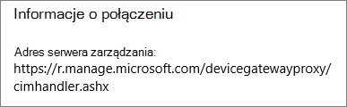
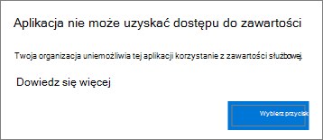
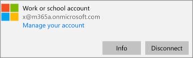
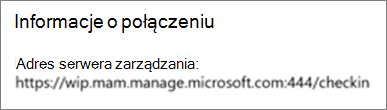

# Sprawdzanie poprawności ustawień ochrony aplikacji na komputerach z systemem Windows 10

## Potwierdzanie, że użytkownicy nie mogą skopiować danych firmowych do plików osobistych na urządzeniach firmowych

Po [skonfigurowaniu zasad ochrony aplikacji](protection-settings-for-windows-10-devices.md) może upłynąć kilka godzin, zanim te zasady zaczną obowiązywać na urządzeniach użytkowników. Jeśli włączono **ustawienie Uniemożliwianie** **użytkownikom kopiowania danych firmowych do plików osobistych i wymuszanie zapisywania plików służbowych w** usłudze OneDrive dla Firm dla urządzeń należących do firmy, można to sprawdzić na urządzeniu użytkownika po nawiązaniu połączenia z usługą Azure AD i zalogowaniu się. 
  
 **Sprawdzanie ustawień połączenia**
  
1. Po zalogowaniu się przy użyciu poświadczeń Microsoft 365 Business i połączeniu z usługą Azure AD zgodnie z opisem w artykule [Konfigurowanie urządzeń z systemem Windows dla użytkowników usługi Microsoft 365 Business](set-up-windows-devices.md) przejdź do obszaru **Ustawienia systemu Windows** \> **Konta** \> **Uzyskaj dostęp do miejsca pracy lub nauki**. Wybierz pozycję **Połączono z usługą Azure AD \<nazwa dzierżawy\>**, a następnie wybierz pozycję **Informacje**.
    
    
  
2. Na stronie Managed\> by tenant name **(Zarządzane przez** \<nazwę dzierżawy) można wyświetlić informacje o **połączeniu** zawierające **adres serwera zarządzania,** takie jak ten pokazany na poniższej rysunku. 
    
    
  
 **Sprawdź, czy nie można wkleić danych firmy w aplikacji niezarządzanej**
  
1. Otwórz program Outlook 2016 zainstalowany przez usługi Microsoft 365 Business.
    
2. Otwórz wiadomość e-mail, a następnie skopiuj z niej jakąś zawartość.
    
    Otwórz Notatnik i spróbuj wkleić w nim tę zawartość.
    
    Zostanie wyświetlony błąd informujący, że aplikacja nie może uzyskać dostępu do zawartości.
    
    
  
    Można jednak wkleić tę zawartość w programie Word 2016.
    
## Potwierdzanie, że użytkownicy nie mogą skopiować danych firmowych do plików osobistych na urządzeniach osobistych

 **Sprawdzanie ustawień połączenia**
  
1. Na urządzeniu osobistym systemu Windows 10, na którym użytkownik jest zalogowany jako użytkownik lokalny, przejdź do **pozycji Ustawienia systemu Windows**i kliknij lub naciśnij pozycję Dostęp do **kont** \> **służbowych lub szkolnych**.
    
2. W obszarze **Uzyskaj dostęp do miejsca pracy lub nauki** wybierz pozycję **Połącz**.
    
3. W oknie dialogowym **Konfigurowanie konta służbowego** \> **Zaloguj się** wprowadź poświadczenia Microsoft 365 Business.
    
4. Na stronie **Uzyskaj dostęp do miejsca pracy lub nauki** wybierz pozycję **Konto służbowe**, a następnie pozycję **Informacje**.
    
    
  
5. Na stronie **Praca programu Access lub szkoła** można wyświetlić informacje o **połączeniu** zawierające **adres serwera zarządzania,** takie jak ten pokazany na poniższej rysunku, i zawierają słowa *wip* i *mam* wewnątrz. 
    
    
  
 **Sprawdź, czy nie można wkleić danych firmy w aplikacji niezarządzanej**
  
1. Otwórz program Outlook 2016 i dodaj konto Microsoft 365 Business, jeśli to konieczne, a następnie zaloguj się przy użyciu poświadczeń Microsoft 365 Business.
    
2. Otwórz wiadomość e-mail, a następnie skopiuj z niej jakąś zawartość.
    
    Otwórz Notatnik i spróbuj wkleić w nim tę zawartość.
    
    Zostanie wyświetlony błąd informujący, że aplikacja nie może uzyskać dostępu do zawartości.
    
    
  
    Można jednak wkleić tę zawartość w programie Word 2016.
    

