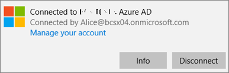

# Sprawdzanie poprawności ustawień ochrony aplikacji na komputerach z systemem Windows 10Validate app protection settings on Windows 10 PCs

## Potwierdzanie, że użytkownicy nie mogą skopiować danych firmowych do plików osobistych na urządzeniach firmowychVerify that users cannot copy company data to personal files on corporate devices

Po [skonfigurowaniu zasad ochrony aplikacji](protection-settings-for-windows-10-devices.md) może upłynąć kilka godzin, zanim te zasady zaczną obowiązywać na urządzeniach użytkowników.After you [set up app protection policies](protection-settings-for-windows-10-devices.md), it may take up to a few hours for the policy to take effect on users' devices. Jeśli **włączono ustawienie Uniemożliwić użytkownikom kopiowanie danych firmowych do plików osobistych i wymusić na nich zapisywanie plików służbowych w usłudze OneDrive dla Firm** dla urządzeń należących do firmy, możesz to sprawdzić na urządzeniu użytkownika po nawiązaniu połączenia z usługą Azure AD i zalogowaniu się. **On**If you turned **On** the **Prevent users from copying company data to personal files and force them to save work files to OneDrive for Business** setting for company owned devices, you can check this on the user's device after they've connected to Azure AD and signed in. 
  
 **Sprawdzanie ustawień połączenia****Verify connection settings**
  
1. Po zalogowaniu się przy użyciu poświadczeń usługi Microsoft 365 Business Premium i nawiązaniu połączenia z usługą Azure AD zgodnie z opisem w [sekcji Konfigurowanie urządzeń z systemem Windows dla użytkowników usługi Microsoft 365 Business Premium](set-up-windows-devices.md)przejdź do sekcji Dostęp do kont ustawień systemu **Windows** w pracy \> **Accounts** \> **lub szkole**.After you sign in with Microsoft 365 Business Premium credentials and connect to Azure AD as described in [Set up Windows devices for Microsoft 365 Business Premium users](set-up-windows-devices.md), go to **Windows Settings** \> **Accounts** \> **Access work or school**. Wybierz pozycję **Połączono z \<tenant name\> usługą Azure AD**, a następnie wybierz pozycję **Informacje**.Choose **Connected to \<tenant name\> Azure AD**, and then choose **Info**.
    
    
  
2. Na stronie **Zarządzane według** \<tenant name\> można wyświetlić informacje o **połączeniu,** które zawierają **adres serwera zarządzania,** taki jak ten pokazany na poniższym rysunku.On the **Managed by** \<tenant name\> page, you can see the **Connection info** that includes a **Management Server Address** like the one shown in the following figure. 
    
    
  
 **Sprawdź, czy nie można wkleić danych firmy w aplikacji niezarządkowej****Verify that you cannot paste company data in a non-managed app**
  
1. Otwórz program Outlook 2016, który został zainstalowany przez usługę Microsoft 365 Business Premium.Open Outlook 2016 that was installed by Microsoft 365 Business Premium.
    
2. Otwórz wiadomość e-mail, a następnie skopiuj z niej jakąś zawartość.Open an email and copy some content from it.
    
    Otwórz Notatnik i spróbuj wkleić w nim tę zawartość.Open Notepad and attempt to paste the content in.
    
    Zostanie wyświetlony błąd informujący, że aplikacja nie może uzyskać dostępu do zawartości.You'll receive an error that states the app can't access content.
    
    
  
    Można jednak wkleić tę zawartość w programie Word 2016.You can, however, paste the same content into Word 2016.
    
## Potwierdzanie, że użytkownicy nie mogą skopiować danych firmowych do plików osobistych na urządzeniach osobistychVerify that users cannot copy company data to personal files on personal devices

 **Sprawdzanie ustawień połączenia****Verify connection settings**
  
1. Na urządzeniu osobistym z systemem Windows 10, na którym użytkownik lokalny jesteś zalogowany, przejdź do **ustawień systemu Windows**i kliknij lub naciśnij pozycję Dostęp do **kont** w pracy \> **lub szkole**.On your Windows 10 personal device where you're logged in as a local user, go to **Windows Settings**, and click or tap **Accounts** \> **Access work or school**.
    
2. W obszarze **Uzyskaj dostęp do miejsca pracy lub nauki** wybierz pozycję **Połącz**.Under the **Access work or school**, choose **Connect**.
    
3. Wprowadź poświadczenia usługi Microsoft 365 Business Premium w **oknie dialogowym Konfigurowanie konta służbowego** \> **Zaloguj się**.Enter your Microsoft 365 Business Premium credential into the **Set up a work or school account dialog** \> **Sign in**.
    
4. Na stronie **Uzyskaj dostęp do miejsca pracy lub nauki** wybierz pozycję **Konto służbowe**, a następnie pozycję **Informacje**.On the **Access work or school** page, choose the **Work or school account**, and then choose **Info**.
    
    
  
5. Na stronie **Praca programu Access lub szkoła** można wyświetlić informacje o **połączeniu,** które zawierają **adres serwera zarządzania,** taki jak ten pokazany na poniższym rysunku, i zawierają słowa *wip* i *mam* wewnątrz.On the **Access work or school** page, you can see the **Connection info** that includes a **Management Server Address** like the one shown in the following figure, and includes the words  *wip*  and  *mam*  within. 
    
    
  
 **Sprawdź, czy nie można wkleić danych firmy w aplikacji niezarządkowej****Verify that you cannot paste company data in a non-managed app**
  
1. Otwórz program Outlook 2016 i w razie potrzeby dodaj konto usługi Microsoft 365 Business Premium i zaloguj się przy użyciu poświadczeń usługi Microsoft 365 Business Premium.Open Outlook 2016 and add your Microsoft 365 Business Premium account if necessary and sign in with your Microsoft 365 Business Premium credentials.
    
2. Otwórz wiadomość e-mail, a następnie skopiuj z niej jakąś zawartość.Open an email and copy some content from it.
    
    Otwórz Notatnik i spróbuj wkleić w nim tę zawartość.Open Notepad and attempt to paste the content in.
    
    Zostanie wyświetlony błąd informujący, że aplikacja nie może uzyskać dostępu do zawartości.You'll receive an error that states App can't access content.
    
    
  
    Można jednak wkleić tę zawartość w programie Word 2016.You can, however, paste the same content into Word 2016.
    

