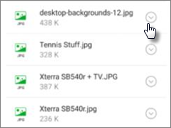

# Sprawdzanie poprawności ustawień ochrony aplikacji na urządzeniach z systemem Android lub iOS

Postępuj zgodnie z instrukcjami w poniższych sekcjach, aby sprawdzić poprawność ustawień ochrony aplikacji na urządzeniach z systemem Android lub iOS.
  
## Android
  
### Sprawdzanie, czy na urządzeniach użytkowników działają ustawienia ochrony aplikacji

Gdy [skonfigurujesz aplikacje dla urządzeń z systemem Android](app-protection-settings-for-android-and-ios.md) w celu ochrony aplikacji, możesz wykonać czynności opisane poniżej, aby sprawdzić działanie wybranych ustawień. 
  
Najpierw upewnij się, że zasady dotyczą aplikacji, w której chcesz ją zweryfikować.
  
1. W centrum Microsoft 365 Business Premium [przejdź](https://admin.microsoft.com)do **pozycji** Zasady \> **Edytuj zasady.**
    
2. Wybierz **pozycję Zasady aplikacji** dla systemu Android dla ustawień utworzonych podczas konfiguracji lub innych utworzonych zasad i sprawdź, czy są wymuszane na przykład Outlook urządzeniach. 
    
    
  
### Sprawdzanie działania ustawienia Wymagaj numeru PIN lub odcisku palca w celu uzyskania dostępu do aplikacji pakietu

W okienku **Edytuj zasady** wybierz pozycję **Edytuj** obok pozycji **Kontrola dostępu do dokumentów pakietu Office**, rozwiń pozycję **Zarządzaj dostępem użytkowników do plików pakietu Office na urządzeniach przenośnych** i upewnij się, że funkcja **Wymagaj numeru PIN lub odcisku palca w celu uzyskania dostępu do aplikacji pakietu Office** jest **włączona**.
  

  
1. Na urządzeniu użytkownika z systemem Android otwórz aplikację Outlook zaloguj się przy użyciu jego poświadczeń logowania Microsoft 365 Business Premium Android.
    
2. Zostanie również wyświetlony monit o wprowadzenie numeru PIN lub użycie odcisku palca.
    
    
  
### Sprawdzanie działania ustawienia Resetuj numer PIN po określonej liczbie nieudanych prób

W  okienku Edytuj  zasady wybierz pozycję Edytuj obok opcji Kontrola dostępu do dokumentów programu Office , **rozwiń** pozycję Zarządzaj dostępem użytkowników do plików programu **Office** na urządzeniach przenośnych i upewnij się, że po liczbie nieudanych prób jest ustawiona wartość Resetuj numer **PIN.** Domyślnie jest to 5. 
  
1. Na urządzeniu użytkownika z systemem Android otwórz aplikację Outlook zaloguj się przy użyciu jego poświadczeń logowania Microsoft 365 Business Premium Android.
    
2. Wprowadź nieprawidłowy numer PIN więcej razy niż zezwalają na to obowiązujące zasady. Zostanie wyświetlony monit z komunikatem Osiągnięto limit prób numeru **PIN,** aby zresetować ten numer. 
    
    
  
3. Naciśnij pozycję **Resetuj numer PIN**. Zostanie wyświetlony monit o zalogowanie się przy użyciu poświadczeń logowania Microsoft 365 Business Premium, a następnie ustawienie nowego numeru PIN.
    
### Sprawdzanie działania ustawienia Wymuszaj na użytkownikach zapisywanie wszystkich plików służbowych w usłudze OneDrive dla Firm

W okienku **Edytuj zasady** wybierz pozycję **Edytuj** obok pozycji **Ochrona w razie utraty lub kradzieży urządzenia**, rozwiń pozycję **Chroń pliki służbowe w przypadku zgubienia lub kradzieży urządzenia** i upewnij się, że funkcja **Wymuszaj na użytkownikach zapisywanie wszystkich plików służbowych w usłudze OneDrive dla Firm** jest **włączona**.
  

  
1. Na urządzeniu użytkownika z systemem Android otwórz aplikację Outlook zaloguj się przy użyciu jego poświadczeń logowania Microsoft 365 Business Premium, a w razie prośby wprowadź numer PIN.
    
2. Otwórz wiadomość e-mail zawierającą załącznik, a następnie naciśnij ikonę strzałki w dół obok informacji o załączniku.
    
    
  
    U dołu ekranu zostanie wyświetlony **obraz** Nie można zapisać na urządzeniu. 
    
    
  
    > [!NOTE]
    > Zapisywanie w usłudze OneDrive dla Firm nie jest obecnie włączone dla systemu Android, więc jest tylko wyświetlana informacja o zablokowanej możliwości zapisywania lokalnie. 
  
### Sprawdzanie działania ustawienia Wymagaj ponownego logowania użytkownika po określonym czasie bezczynności aplikacji pakietu Office

W  okienku Edytuj  zasady wybierz pozycję Edytuj obok opcji Kontrola dostępu do dokumentów programu **Office**, rozwiń  pozycję Zarządzaj dostępem użytkowników do plików programu **Office** na urządzeniach przenośnych i upewnij się, że ustawienie Wymagaj ponownego logowania użytkowników po Office, gdy aplikacje nie są bezczynne, ma ustawioną wartość pewnymi minutami. Domyślnie jest to 30 minut. 
  
1. Na urządzeniu użytkownika z systemem Android otwórz aplikację Outlook zaloguj się przy użyciu jego poświadczeń logowania Microsoft 365 Business Premium, a w razie prośby wprowadź numer PIN.
    
2. Powinna zostać wyświetlona skrzynka odbiorcza aplikacji Outlook. Nie dotykaj urządzenia z systemem Android przez co najmniej 30 minut (lub inny czas dłuższy niż wartość określona w zasadach). Ekran urządzenia prawdopodobnie zostanie wygaszony.
    
3. Ponownie Outlook na urządzeniu z systemem Android.
    
4. Zanim będzie można ponownie uzyskać dostęp do swojego numeru PIN, zostanie Outlook monit o wprowadzenie numeru PIN.
    
### Sprawdzanie działania ustawienia Chroń pliki służbowe przy użyciu szyfrowania

W okienku **Edytuj zasady** wybierz pozycję **Edytuj** obok pozycji **Ochrona w razie utraty lub kradzieży urządzenia**, rozwiń pozycję **Chroń pliki służbowe w przypadku zgubienia lub kradzieży urządzenia** i upewnij się, że funkcja **Chroń pliki służbowe przy użyciu szyfrowania** jest **włączona**, a funkcja **Wymuszaj na użytkownikach zapisywanie wszystkich plików służbowych w usłudze OneDrive dla Firm** jest **wyłączona**.
  
1. Na urządzeniu użytkownika z systemem Android otwórz aplikację Outlook zaloguj się przy użyciu jego poświadczeń logowania Microsoft 365 Business Premium, a w razie prośby wprowadź numer PIN.
    
2. Otwórz wiadomość e-mail zawierającą kilka załączników do pliku obrazu.
    
3. Naciśnij ikonę strzałki w dół obok informacji o załączniku, aby go zapisać.
    
    
  
4. Może pojawić się monit o zezwolenie programowi Outlook na dostęp do zdjęć, multimediów i plików na urządzeniu. Naciśnij pozycję **Zezwalaj**.
    
5. U dołu ekranu wybierz pozycję **Zapisz na urządzeniu**, a następnie otwórz aplikację **Galeria**. 
    
6. Na liście powinno zostać wyświetlone zaszyfrowane zdjęcie (lub kilka zdjęć, jeśli zapisano ich więcej). Może ono być wyświetlane na liście obrazów w postaci szarego kwadratu z białym wykrzyknikiem w białym okręgu w środku szarego kwadratu.
    
    
  
## iOS
  
### Sprawdzanie, czy na urządzeniach użytkowników działają ustawienia ochrony aplikacji

Gdy [skonfigurujesz aplikacje dla urządzeń z systemem iOS](app-protection-settings-for-android-and-ios.md) w celu ochrony aplikacji, możesz wykonać czynności opisane poniżej, aby sprawdzić działanie wybranych ustawień. 
  
Najpierw upewnij się, że zasady dotyczą aplikacji, w której chcesz ją zweryfikować.
  
1. W centrum Microsoft 365 Business Premium [przejdź](https://admin.microsoft.com)do **pozycji** Zasady \> **Edytuj zasady.**
    
2. Wybierz pozycję Zasady aplikacji dla systemu **iOS** dla ustawień utworzonych podczas instalacji lub innych utworzonych zasad i sprawdź, czy są wymuszane na przykład Outlook konfiguracji. 
    
    
  
### Sprawdzanie działania ustawienia Wymagaj numeru PIN w celu uzyskania dostępu do aplikacji pakietu Office

W okienku **Edytuj zasady** wybierz pozycję **Edytuj** obok pozycji **Kontrola dostępu do dokumentów pakietu Office**, rozwiń pozycję **Zarządzaj dostępem użytkowników do plików pakietu Office na urządzeniach przenośnych** i upewnij się, że funkcja **Wymagaj numeru PIN lub odcisku palca w celu uzyskania dostępu do aplikacji pakietu Office** jest **włączona**.
  

  
1. Na urządzeniu użytkownika z systemem iOS otwórz Outlook zaloguj się przy użyciu poświadczeń logowania Microsoft 365 Business Premium użytkownika.
    
2. Zostanie również wyświetlony monit o wprowadzenie numeru PIN lub użycie odcisku palca.
    
    
  
### Sprawdzanie działania ustawienia Resetuj numer PIN po określonej liczbie nieudanych prób

W  okienku Edytuj  zasady wybierz pozycję Edytuj obok opcji Kontrola dostępu do dokumentów programu Office , **rozwiń** pozycję Zarządzaj dostępem użytkowników do plików programu **Office** na urządzeniach przenośnych i upewnij się, że po liczbie nieudanych prób jest ustawiona wartość Resetuj numer **PIN.** Domyślnie jest to 5. 
  
1. Na urządzeniu użytkownika z systemem iOS otwórz Outlook zaloguj się przy użyciu poświadczeń logowania Microsoft 365 Business Premium użytkownika.
    
2. Wprowadź nieprawidłowy numer PIN więcej razy niż zezwalają na to obowiązujące zasady. Zostanie wyświetlony monit z komunikatem Osiągnięto limit prób numeru **PIN,** aby zresetować ten numer. 
    
    
  
3. Naciśnij przycisk **OK**. Zostanie wyświetlony monit o zalogowanie się przy użyciu poświadczeń logowania Microsoft 365 Business Premium, a następnie ustawienie nowego numeru PIN.
    
### Sprawdzanie działania ustawienia Wymuszaj na użytkownikach zapisywanie wszystkich plików służbowych w usłudze OneDrive dla Firm

W okienku **Edytuj zasady** wybierz pozycję **Edytuj** obok pozycji **Ochrona w razie utraty lub kradzieży urządzenia**, rozwiń pozycję **Chroń pliki służbowe w przypadku zgubienia lub kradzieży urządzenia** i upewnij się, że funkcja **Wymuszaj na użytkownikach zapisywanie wszystkich plików służbowych w usłudze OneDrive dla Firm** jest **włączona**.
  

  
1. Na urządzeniu użytkownika z systemem iOS otwórz program Outlook zaloguj się przy użyciu poświadczeń logowania Microsoft 365 Business Premium i w razie prośby wprowadź numer PIN.
    
2. Otwórz wiadomość e-mail z załącznikiem, otwórz ten załącznik i wybierz pozycję **Zapisz** u dołu ekranu. 
    
    
  
3. Powinna być widoczna tylko jedna opcja umożliwiająca zapisanie pliku w usłudze OneDrive dla Firm. Jeśli nie, naciśnij **pozycję Dodaj konto** i wybierz pozycję **OneDrive dla Firm** na ekranie **Storage konto.** Podaj nazwę użytkownika końcowego, Microsoft 365 Business Premium się po wyświetleniu monitu. 
    
    Naciśnij przycisk **Zapisz** i wybierz opcję **OneDrive dla Firm**.
    
### Sprawdzanie działania ustawienia Wymagaj ponownego logowania użytkownika po określonym czasie bezczynności aplikacji pakietu Office

W  okienku Edytuj  zasady wybierz pozycję Edytuj obok opcji Kontrola dostępu do dokumentów programu **Office**, rozwiń  pozycję Zarządzaj dostępem użytkowników do plików programu **Office** na urządzeniach przenośnych i upewnij się, że ustawienie Wymagaj ponownego logowania użytkowników po Office, gdy aplikacje nie są bezczynne, ma ustawioną wartość pewnymi minutami. Domyślnie jest to 30 minut. 
  
1. Na urządzeniu użytkownika z systemem iOS otwórz program Outlook zaloguj się przy użyciu poświadczeń logowania Microsoft 365 Business Premium i w razie prośby wprowadź numer PIN.
    
2. Powinna zostać wyświetlona skrzynka odbiorcza aplikacji Outlook. Nie dotykaj urządzenia z systemem iOS przez co najmniej 30 minut (lub inny czas, który jest dłuższy od wartości określonej w zasadach). Ekran urządzenia prawdopodobnie zostanie wygaszony.
    
3. Ponownie Outlook na urządzeniu z systemem iOS.
    
4. Zanim będzie można ponownie uzyskać dostęp do swojego numeru PIN, zostanie Outlook monit o wprowadzenie numeru PIN.
    
### Sprawdzanie działania ustawienia Chroń pliki służbowe przy użyciu szyfrowania

W okienku **Edytuj zasady** wybierz pozycję **Edytuj** obok pozycji **Ochrona w razie utraty lub kradzieży urządzenia**, rozwiń pozycję **Chroń pliki służbowe w przypadku zgubienia lub kradzieży urządzenia** i upewnij się, że funkcja **Chroń pliki służbowe przy użyciu szyfrowania** jest **włączona**, a funkcja **Wymuszaj na użytkownikach zapisywanie wszystkich plików służbowych w usłudze OneDrive dla Firm** jest **wyłączona**.
  
1. Na urządzeniu użytkownika z systemem iOS otwórz program Outlook zaloguj się przy użyciu poświadczeń logowania Microsoft 365 Business Premium i w razie prośby wprowadź numer PIN.
    
2. Otwórz wiadomość e-mail zawierającą kilka załączników do pliku obrazu.
    
3. Naciśnij załącznik i wybierz pod nim opcję **Zapisz**. 
    
4. Otwórz aplikację **Zdjęcia** na ekranie głównym. Zobaczysz zapisane zdjęcie (lub kilka, jeśli zapiszesz ich więcej) w zaszyfrowanej postaci. 
    
---

