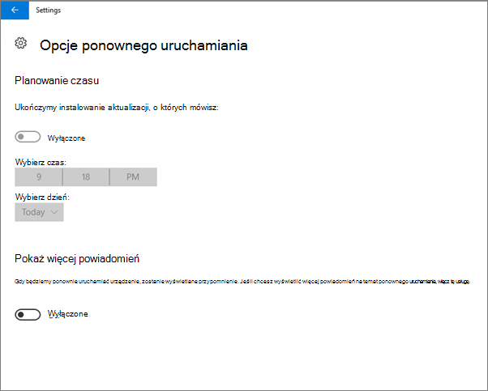
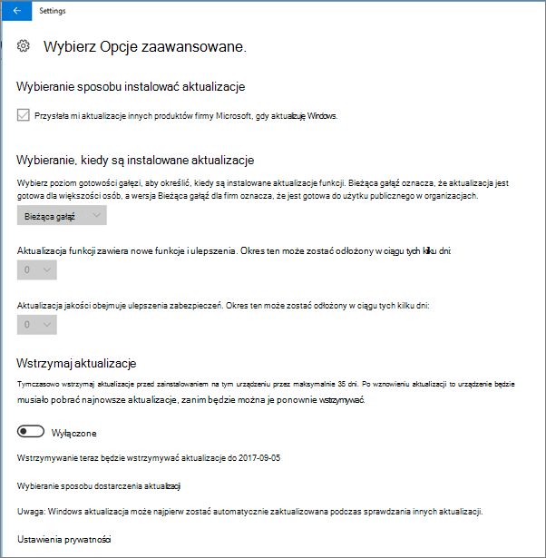
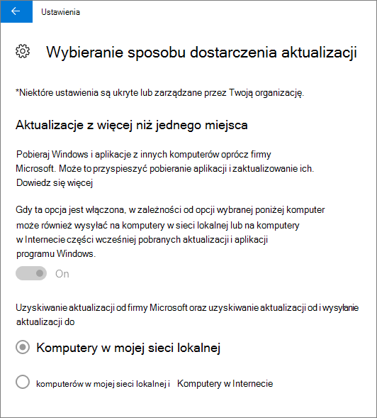
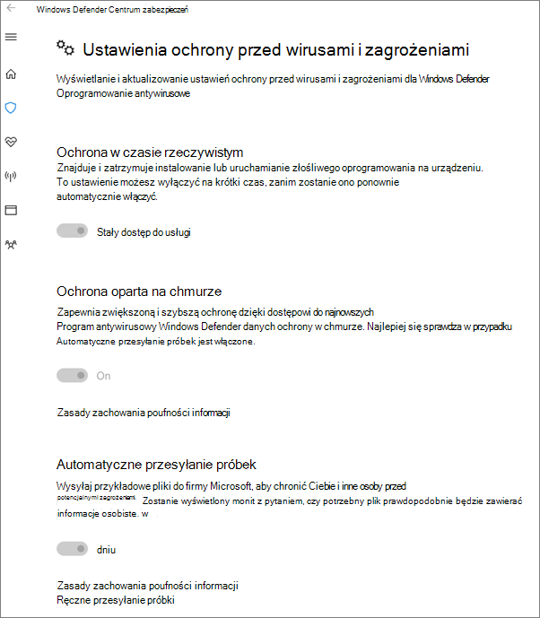

# Sprawdzanie poprawności ustawień ochrony urządzeń na komputerach z systemem Windows 10

## Sprawdzanie, czy ustawiono zasady dotyczące urządzeń z systemem Windows 10

Po [skonfigurowaniu zasad urządzeń](protection-settings-for-windows-10-pcs.md)może upłynieć kilka godzin, aż te zasady zajdą w życie na urządzeniach użytkowników. Aby potwierdzić, że zasady te obowiązywały, możesz zobaczyć różne ekrany ustawień systemu Windows na urządzeniach użytkowników. Ponieważ użytkownicy nie będą mogli modyfikować ustawień oprogramowania antywirusowego Windows Update i Windows Defender na urządzeniach z systemem Windows 10, wiele opcji zostanie wyszarowanych.
  
1. Przejdź do opcji **Ustawienia** \> **Aktualizacja &amp; zabezpieczeń** \> **Uruchom ponownie usługę Windows Update** i upewnij się, że wszystkie ustawienia są \>  wyszarowane. 
    
    
  
2. Przejdź do opcji **Ustawienia** Zaktualizuj zabezpieczenia Windows Update Zaawansowane i upewnij się, że wszystkie ustawienia \> **&amp;** \>  \>  są wyszarowane. 
    
    
  
3. Przejdź  do ustawień \> **Aktualizacja &amp; zabezpieczeń Opcje** \> **zaawansowane usługi Windows Update** Wybierz sposób dostarczenia \>  \> **aktualizacji.**
    
    Potwierdź, że widzisz komunikat (kolor czerwony), że niektóre ustawienia są ukryte lub zarządzane przez Twoją organizację, a wszystkie opcje są wyszarowane.
    
    
  
4. Aby otworzyć usługę Windows Defender Security Center, przejdź do **ustawienia** Zaktualizuj zabezpieczenia Programu Windows Defender, kliknij pozycję Otwórz ochronę wątku wirusów programu \> **&amp;** \>  \> Windows  \> **Defender: &amp;** \> **ustawienia ochrony przed zagrożeniami w &amp; programie Windows Defender.** 
    
5. Sprawdź, czy wszystkie opcje są wyszarowane. 
    
    
  
## Tematy pokrewne

[Dokumentacja i zasoby dotyczące platformy Microsoft 365 dla firm](./index.yml)
  
[Wprowadzenie do platformy Microsoft 365 dla firm](microsoft-365-business-overview.md)
  
[Zarządzanie usługą Microsoft 365 dla firm](manage.md)
  
[Konfigurowanie komputerów PC z systemem Windows 10](protection-settings-for-windows-10-pcs.md)
