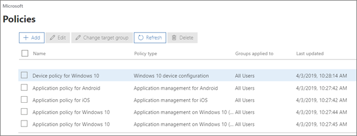
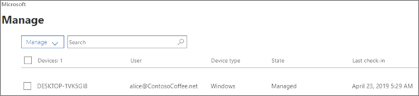

# Wyświetlanie zasad i urządzeń oraz zarządzanie nimiView and manage policies and devices

## Wyświetlanie i edytowanie zasad urządzeńView and edit device policies

1.  Przejdź do centrum <a href="https://go.microsoft.com/fwlink/p/?linkid=837890" target="_blank">https://admin.microsoft.com</a>administracyjnego w .Go to the admin center at <a href="https://go.microsoft.com/fwlink/p/?linkid=837890" target="_blank">https://admin.microsoft.com</a>.
2. Po lewej stronie urządzenia wybierz pozycję **Zasady** **urządzeń** \> .On the left nav, choose **Devices** \> **Policies**.

    Na tej stronie możesz utworzyć, edytować, zmienić grupę docelową lub usunąć zasadę.On this page, you can create, edit, change target group, or delete a policy.

    
  
## Wyświetlanie urządzeń i zarządzanie nimiView and manage devices

1. Po lewej stronie urządzenia wybierz pozycję **Zarządzanie urządzeniami** \> **Manage**.On the left nav, choose **Devices** \> **Manage**. 
    
    Na tej stronie możesz wybrać jedno lub więcej urządzeń i usunąć dane firmowe.On this page, you can select one or more devices and remove company data. W przypadku urządzeń z systemem Windows 10, dla których skonfigurowano ustawienia ochrony urządzeń, możesz także wybrać opcję przywrócenia ustawień fabrycznych.For Windows 10 devices that you have set device protections settings for, you can also choose to reset the device to factory settings.
  
   

